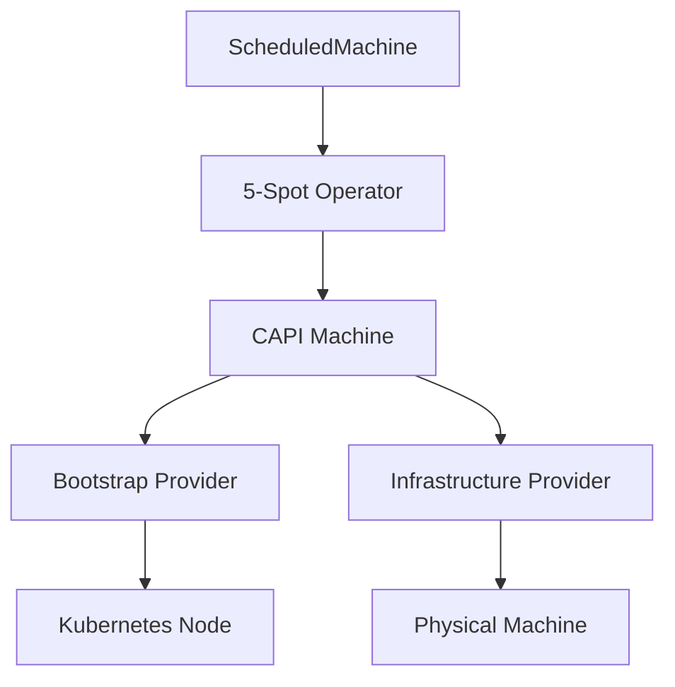
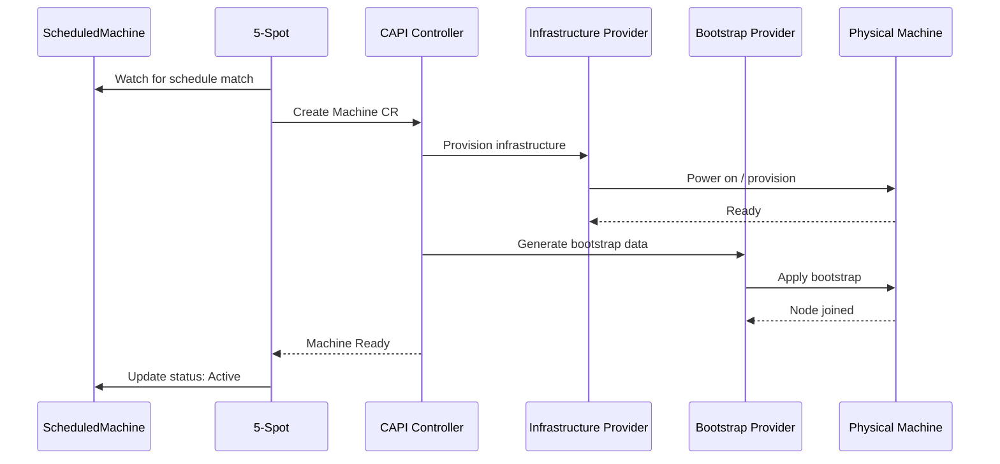
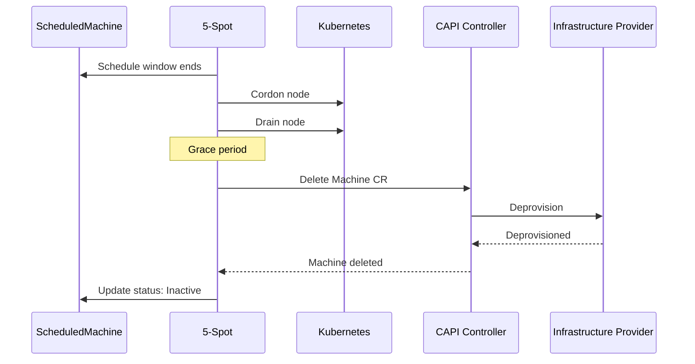

# CAPI Integration

How 5-Spot integrates with Cluster API (CAPI) for machine lifecycle management.

## Overview

5-Spot leverages CAPI's infrastructure abstraction to manage physical machines:



## CAPI Resources

### Machine

5-Spot creates CAPI `Machine` resources:

```yaml
apiVersion: cluster.x-k8s.io/v1beta1
kind: Machine
metadata:
  name: scheduled-machine-worker-xyz
  namespace: default
  ownerReferences:
    - apiVersion: capi.5spot.io/v1alpha1
      kind: ScheduledMachine
      name: scheduled-machine
spec:
  clusterName: my-cluster
  bootstrap:
    configRef:
      apiVersion: bootstrap.cluster.x-k8s.io/v1beta1
      kind: KubeadmConfig
      name: worker-bootstrap
  infrastructureRef:
    apiVersion: infrastructure.cluster.x-k8s.io/v1beta1
    kind: BareMetalMachine
    name: worker-infra
```

### Bootstrap Configuration

Reference to bootstrap provider configuration:

```yaml
bootstrapRef:
  apiVersion: bootstrap.cluster.x-k8s.io/v1beta1
  kind: KubeadmConfigTemplate
  name: worker-bootstrap-template
  namespace: default
```

### Infrastructure Template

Reference to infrastructure provider template:

```yaml
infrastructureRef:
  apiVersion: infrastructure.cluster.x-k8s.io/v1beta1
  kind: Metal3MachineTemplate
  name: worker-machine-template
  namespace: default
```

## Supported Providers

5-Spot works with any CAPI infrastructure provider:

| Provider | Use Case |
|----------|----------|
| Metal3 | Bare metal via Ironic |
| Packet/Equinix | Cloud bare metal |
| vSphere | VMware virtual machines |
| AWS | EC2 instances |
| Azure | Azure VMs |
| GCP | GCE instances |

## Machine Creation Flow



## Machine Deletion Flow



## Configuration Examples

### k0smotron / k0s

```yaml
spec:
  bootstrapRef:
    apiVersion: bootstrap.cluster.x-k8s.io/v1beta1
    kind: K0sWorkerConfigTemplate
    name: worker-config
    namespace: default
  infrastructureRef:
    apiVersion: infrastructure.cluster.x-k8s.io/v1beta1
    kind: K0smotronMachineTemplate
    name: k0s-worker
    namespace: default
  clusterName: k0s-cluster
```

### Metal3

```yaml
spec:
  bootstrapRef:
    apiVersion: bootstrap.cluster.x-k8s.io/v1beta1
    kind: KubeadmConfigTemplate
    name: kubeadm-worker
    namespace: default
  infrastructureRef:
    apiVersion: infrastructure.cluster.x-k8s.io/v1beta1
    kind: Metal3MachineTemplate
    name: metal3-worker
    namespace: default
  clusterName: metal3-cluster
```

## Error Handling

### Infrastructure Provisioning Failure

- ScheduledMachine enters `Error` phase
- Condition updated with error details
- Automatic retry with backoff

### Bootstrap Failure

- CAPI handles bootstrap retries
- 5-Spot monitors Machine status
- Propagates errors to ScheduledMachine status

### Node Join Failure

- Machine marked as not ready
- ScheduledMachine reflects unhealthy state
- Manual intervention may be required

## Related

- [Architecture](../concepts/architecture.md) - System design
- [ScheduledMachine](../concepts/scheduled-machine.md) - CRD specification
- [Troubleshooting](../operations/troubleshooting.md) - Common issues
