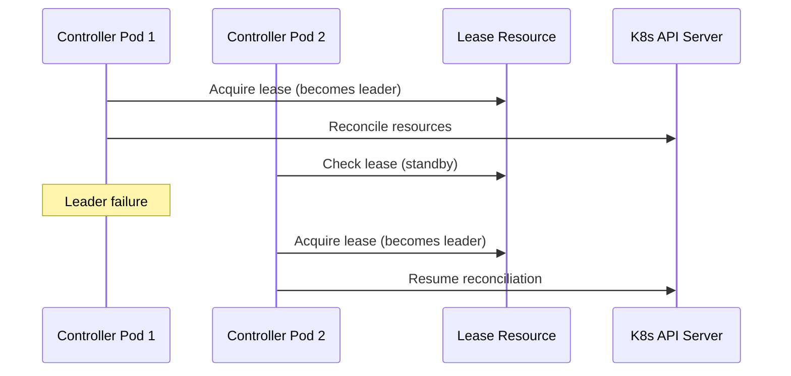

# High Availability

Strategies for running 5-Spot in highly available configurations.

## Leader Election with Kube-Lease

5-Spot uses Kubernetes lease-based leader election for high availability. This allows running multiple controller replicas where:

- Only one instance (the leader) actively reconciles resources
- Other instances remain on standby for automatic failover
- Failover occurs automatically within ~15 seconds if the leader fails

### How It Works



## Deployment Configuration

Use a standard Deployment (not StatefulSet) with leader election:

```yaml
apiVersion: apps/v1
kind: Deployment
metadata:
  name: 5spot-controller
spec:
  replicas: 2  # Or 3 for higher availability
  selector:
    matchLabels:
      app: 5spot-controller
  template:
    spec:
      containers:
        - name: controller
          env:
            - name: ENABLE_LEADER_ELECTION
              value: "true"
            - name: LEASE_NAME
              value: "5spot-leader"
            - name: LEASE_DURATION_SECONDS
              value: "15"
            - name: LEASE_RENEW_DEADLINE_SECONDS
              value: "10"
            - name: LEASE_RETRY_PERIOD_SECONDS
              value: "2"
```

### Leader Election Environment Variables

| Variable | Default | Description |
|----------|---------|-------------|
| `ENABLE_LEADER_ELECTION` | `false` | Enable leader election |
| `LEASE_NAME` | `5spot-leader` | Name of the Lease resource |
| `LEASE_DURATION_SECONDS` | `15` | How long the lease is valid |
| `LEASE_RENEW_DEADLINE_SECONDS` | `10` | How long to try renewing before giving up |
| `LEASE_RETRY_PERIOD_SECONDS` | `2` | How often to retry acquiring the lease |

## Cross-AZ Deployment

### Pod Anti-Affinity

Spread controller pods across availability zones:

```yaml
spec:
  template:
    spec:
      affinity:
        podAntiAffinity:
          preferredDuringSchedulingIgnoredDuringExecution:
            - weight: 100
              podAffinityTerm:
                labelSelector:
                  matchLabels:
                    app: 5spot-controller
                topologyKey: topology.kubernetes.io/zone
```

### Topology Spread Constraints

```yaml
spec:
  template:
    spec:
      topologySpreadConstraints:
        - maxSkew: 1
          topologyKey: topology.kubernetes.io/zone
          whenUnsatisfiable: ScheduleAnyway
          labelSelector:
            matchLabels:
              app: 5spot-controller
```

## Failure Scenarios

### Leader Failure

When the leader pod fails:

1. Lease expires after `LEASE_DURATION_SECONDS` (default: 15s)
2. Standby instance acquires the lease
3. New leader begins reconciling all resources
4. No resource ownership complexity - single active controller

### API Server Unavailable

- Controller enters exponential backoff
- Resumes normal operation when API returns
- No state corruption

## Recovery Procedures

### Automatic Failover

1. Leader pod terminates (receives SIGTERM)
2. In-flight reconciliations complete gracefully
3. Standby pod acquires lease (~15 seconds)
4. New leader resumes reconciliation

### Full Cluster Recovery

1. All controller instances start
2. First to acquire lease becomes leader
3. Full reconciliation performed
4. State converges to desired

## Disaster Recovery

### Backup

ScheduledMachine resources are stored in etcd. Use standard Kubernetes backup:

```bash
# Export all ScheduledMachines
kubectl get scheduledmachines -A -o yaml > backup.yaml

# Or use Velero
velero backup create 5spot-backup --include-resources scheduledmachines
```

### Restore

```bash
# Restore from YAML
kubectl apply -f backup.yaml

# Or with Velero
velero restore create --from-backup 5spot-backup
```

## Monitoring HA

### Alerts

```yaml
groups:
  - name: 5spot-ha
    rules:
      - alert: FiveSpotQuorumLoss
        expr: count(five_spot_up == 1) < 2
        for: 5m
        labels:
          severity: critical
        annotations:
          summary: "Less than 2 5-Spot instances running"

      - alert: FiveSpotInstanceSkew
        expr: max(five_spot_machines_total) - min(five_spot_machines_total) > 10
        for: 15m
        labels:
          severity: warning
        annotations:
          summary: "Uneven resource distribution across instances"
```

## Related

- [Multi-Instance](../operations/multi-instance.md) - Instance configuration
- [Resource Distribution](./resource-distribution.md) - How resources are assigned
- [Monitoring](../operations/monitoring.md) - Monitoring setup
