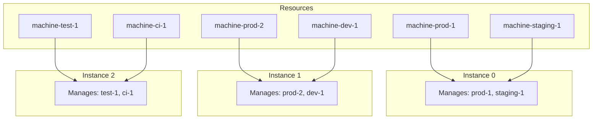

# Resource Distribution

How 5-Spot distributes ScheduledMachine resources across multiple controller instances.

## Consistent Hashing

5-Spot uses consistent hashing to distribute resources:

1. **Deterministic**: Same resource always maps to same instance
2. **Even Distribution**: Resources spread evenly across instances
3. **Minimal Disruption**: Scaling changes affect minimal resources

## Algorithm

```rust
fn resource_owner(resource_name: &str, instance_count: u32) -> u32 {
    let hash = fnv1a_hash(resource_name);
    hash % instance_count
}

fn should_reconcile(resource_name: &str, my_id: u32, total: u32) -> bool {
    resource_owner(resource_name, total) == my_id
}
```

## Distribution Visualization



## Scaling Impact

### Adding an Instance (2 → 3)

Before:
- Instance 0: Resources A, B, C
- Instance 1: Resources D, E, F

After:
- Instance 0: Resources A, C
- Instance 1: Resources D, F
- Instance 2: Resources B, E

Only ~33% of resources change ownership.

### Removing an Instance (3 → 2)

Before:
- Instance 0: Resources A, C
- Instance 1: Resources D, F
- Instance 2: Resources B, E

After:
- Instance 0: Resources A, B, C
- Instance 1: Resources D, E, F

Resources from removed instance are redistributed.

## Priority Handling

Resources with priority are still distributed by consistent hashing:

```yaml
spec:
  priority: 100  # Does not affect which instance handles it
```

Priority affects:
- Order of processing within an instance
- Not which instance processes it

## Namespace Considerations

Resources in different namespaces are distributed independently:

```
default/machine-a     → Instance 0
default/machine-b     → Instance 1
production/machine-a  → Instance 2  # Different namespace = different hash
```

## Troubleshooting Distribution

### Check Resource Owner

```bash
# In controller logs
kubectl logs -n 5spot-system 5spot-controller-0 | grep "machine-name"
```

### Verify Even Distribution

```promql
# Should show roughly equal counts
sum by (pod) (five_spot_machines_total)
```

### Force Reconciliation

Updating a resource triggers reconciliation on its owner:

```bash
kubectl annotate scheduledmachine <name> force-reconcile=$(date +%s)
```

## Related

- [Multi-Instance](../operations/multi-instance.md) - Instance configuration
- [High Availability](./ha.md) - HA strategies
- [Architecture](../concepts/architecture.md) - System design
