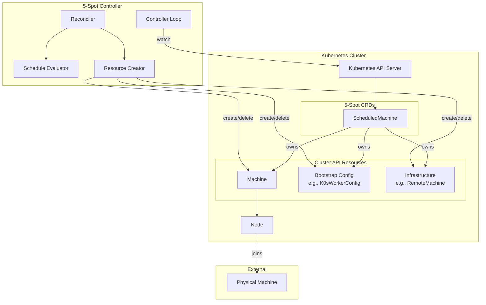
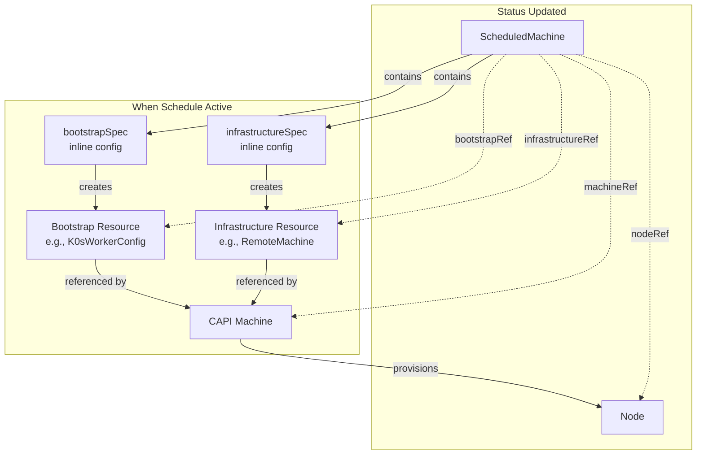
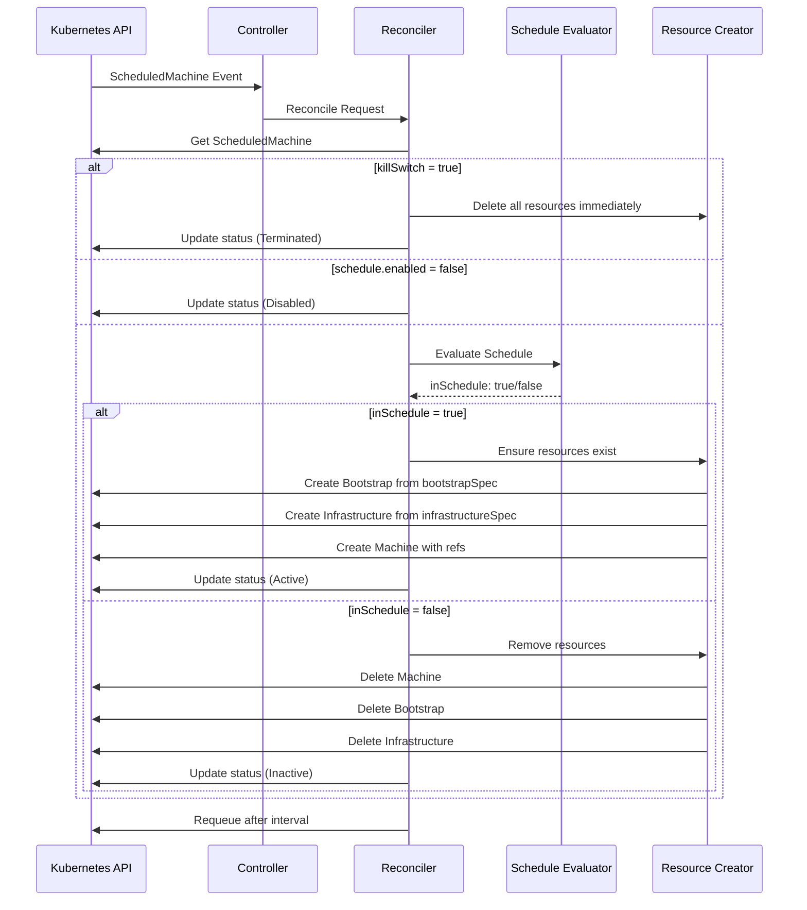
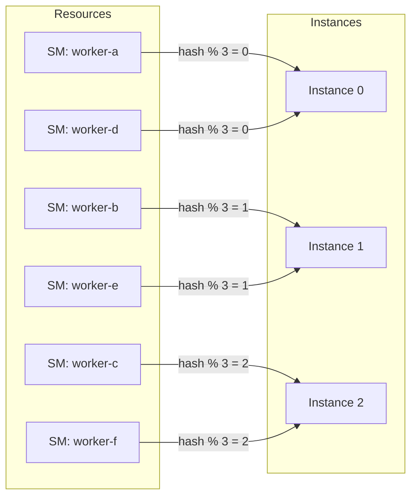
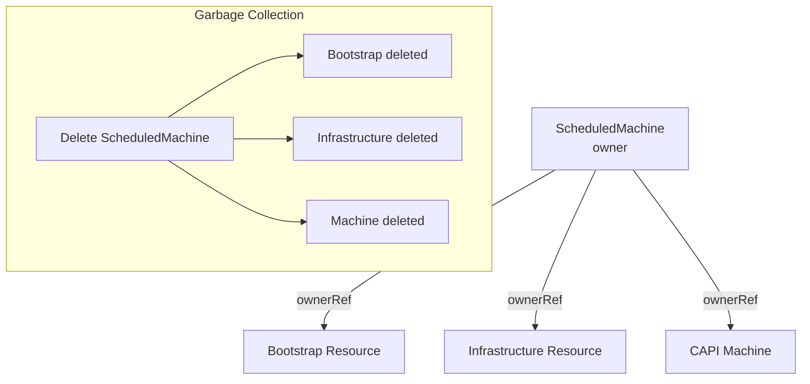
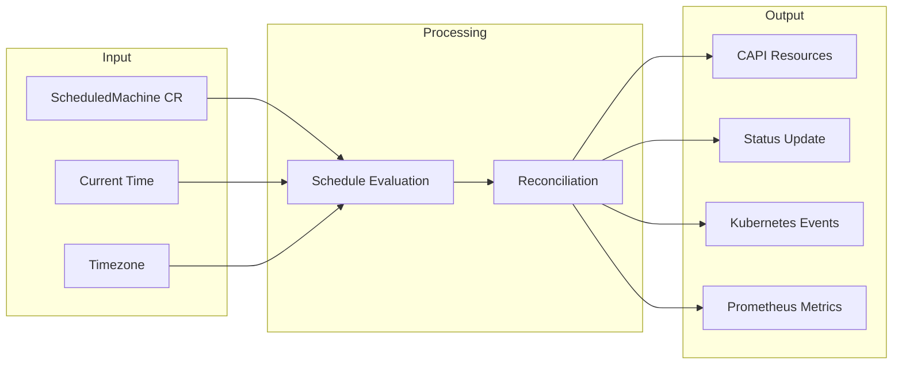

# Architecture

5-Spot is built as a Kubernetes controller using the kube-rs framework.

## High-Level Architecture

## Component Details

### Controller

The main entry point that:

- Watches for ScheduledMachine resource changes
- Manages reconciliation queue
- Handles multi-instance distribution via consistent hashing
- Provides health and metrics endpoints

### Reconciler

Implements the reconciliation loop:

1. Fetch current ScheduledMachine state
2. Check for kill switch or disabled schedule
3. Evaluate schedule against current time (in configured timezone)
4. Determine desired state (active/inactive)
5. Create or delete CAPI resources as needed
6. Update status, conditions, and references

### Schedule Evaluator

Evaluates time-based schedules:

- Parses cron expressions (when specified)
- Parses day ranges (e.g., `mon-fri`, with wrap-around support)
- Parses hour ranges (e.g., `9-17`, with wrap-around support)
- Handles timezone conversions using IANA timezone database
- Determines if current time is within schedule

### Resource Creator

Creates and manages CAPI resources from inline specs:

- Creates Bootstrap resource from `bootstrapSpec`
- Creates Infrastructure resource from `infrastructureSpec`
- Creates CAPI Machine with references to both
- Sets owner references for automatic garbage collection
- Tracks created resource references in status

## Resource Creation Flow

## Reconciliation Flow

## Multi-Instance Support

5-Spot supports running multiple instances for high availability:

- **Consistent Hashing**: Resources are distributed based on name hash
- **Instance ID**: Each instance has a unique ID (0 to N-1)
- **No Overlap**: Each resource is managed by exactly one instance
- **Environment Variables**: `OPERATOR_INSTANCE_ID` and `OPERATOR_INSTANCE_COUNT`

## Owner References & Garbage Collection

5-Spot uses Kubernetes owner references for automatic cleanup:

When a ScheduledMachine is deleted, Kubernetes automatically garbage collects all owned resources.

## Data Flow

## Error Handling

| Error Type | Handling | Requeue |
|------------|----------|---------|
| Transient API errors | Automatic retry | 30s with backoff |
| Schedule parse errors | Status updated with error | No requeue |
| Resource creation failures | Retry with backoff | Up to 5m max |
| Permanent errors | Manual intervention required | No automatic retry |

## Observability

### Health Endpoints

- `/health` - Liveness probe (port 8081)
- `/ready` - Readiness probe (port 8081)

### Metrics

- `/metrics` - Prometheus metrics (port 8080)
- Reconciliation duration, success/failure counts
- Resource counts by phase

### Events

Kubernetes events are emitted for:
- Machine creation/deletion
- Schedule activation/deactivation
- Errors and warnings

## Related

- [Concepts Overview](./index.md)
- [Machine Lifecycle](./machine-lifecycle.md)
- [Multi-Instance](../operations/multi-instance.md)
