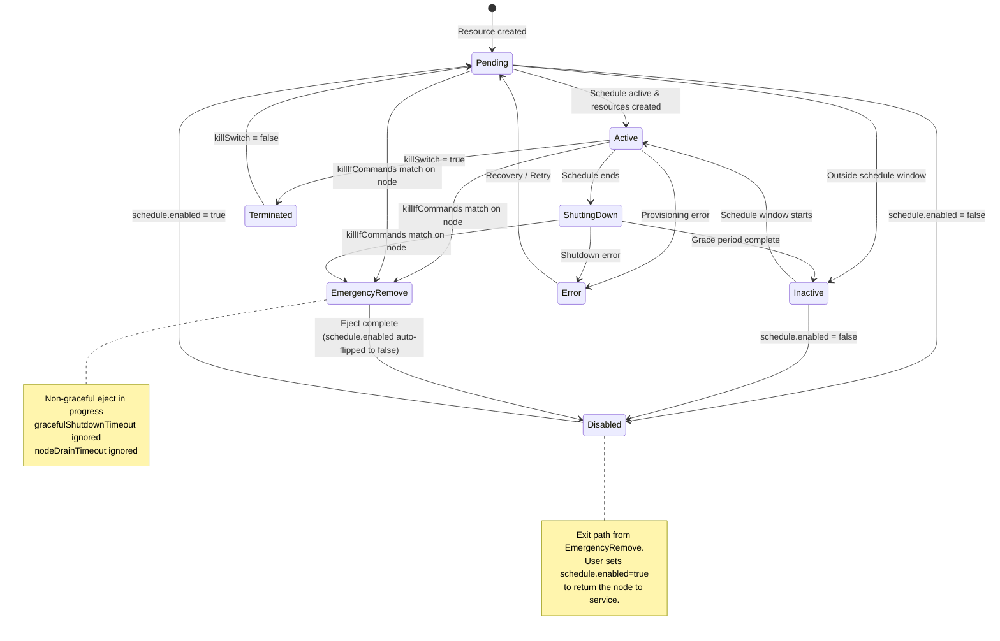
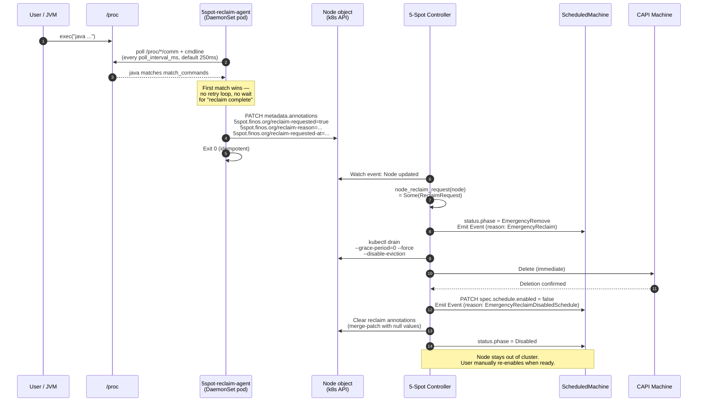
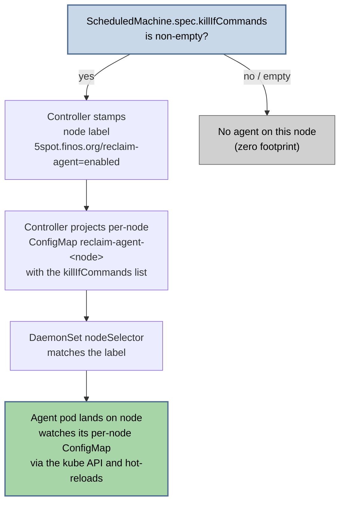
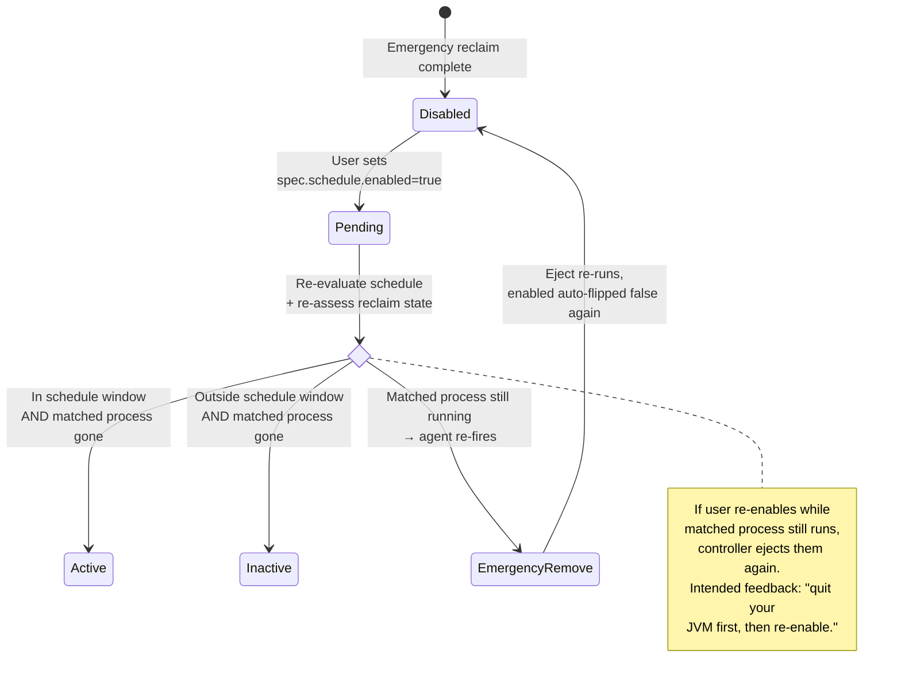

# Emergency Reclaim (Process-Match Kill Switch)

**Status:** In progress — trigger contract, node-side agent (rung 1 `/proc` poll), CRD field, and opt-in DaemonSet shipped. Controller-side dispatch (Phase `EmergencyRemove`) is follow-up work. See the [roadmap](https://github.com/finos/5-spot/blob/main/docs/roadmaps/5spot-emergency-reclaim-by-process-match.md) for the current implementation cut.

---

## Why emergency reclaim exists

`ScheduledMachine` is built for **time-based** scheduling: a workstation joins the cluster at 9 AM, leaves at 5 PM, next morning it joins again. That model assumes the human owner of the machine does not need it back *right now* — they'll get it back at the next schedule boundary.

Real-world usage breaks that assumption. When a developer whose workstation doubles as a cluster node opens IntelliJ or fires up a JVM, the schedule is irrelevant: they want the box back **immediately**. Waiting for the next schedule boundary — or even a graceful drain (tens of seconds to minutes) — is unacceptable while the user is staring at a spinning JVM startup and the cluster is eating their cores.

Emergency reclaim is the **nuclear eject path**: a node-side agent watches for a user-declared set of process names / argv patterns, and on first match, rips the node out of the cluster as fast as physically possible.

## Two kill switches, one family

5-Spot ships **two** emergency-remove mechanisms. They share the same "skip graceful drain, eject now" semantics but differ in who pulls the trigger:

| Mechanism | Trigger | Phase | Side effect | Reset |
|-----------|---------|-------|-------------|-------|
| **`spec.killSwitch: true`** | Operator edits the `ScheduledMachine` | `Terminated` | None — machine stays terminated until operator resets | Operator sets `killSwitch: false` |
| **`spec.killIfCommands: [...]`** (this page) | Agent on the node sees a matching process | `EmergencyRemove` | Controller flips `spec.schedule.enabled=false` so the machine does not auto-rejoin at the next schedule boundary | Operator (or the user whose workstation it is) sets `schedule.enabled: true` — see [User-facing re-enable flow](#user-facing-re-enable-flow) below |

Both are opt-in: `killSwitch` defaults to `false`, and `killIfCommands` is absent by default (no agent installed on the node).

---

## The trigger chain

```mermaid
flowchart LR
    A["User launches<br/>matching process<br/>(e.g. java)"]
    B["/proc/&lt;pid&gt;/comm<br/>+ /proc/&lt;pid&gt;/cmdline"]
    C["5spot-reclaim-agent<br/>(DaemonSet pod)"]
    D["PATCH Node<br/>metadata.annotations"]
    E["5-Spot Controller<br/>(watch on Node)"]
    F["Phase::EmergencyRemove<br/>on ScheduledMachine"]
    G["kubectl drain<br/>--grace-period=0 --force<br/>--disable-eviction"]
    H["Delete CAPI Machine<br/>(no graceful shutdown)"]
    I["PATCH ScheduledMachine<br/>spec.schedule.enabled=false"]
    J["Clear reclaim<br/>annotations from Node"]

    A --> B --> C --> D --> E --> F --> G --> H --> I --> J

    style A fill:#f9d5a7,stroke:#e17b4b,stroke-width:2px,color:#000
    style C fill:#c8d8e8,stroke:#4f6d91,stroke-width:2px,color:#000
    style E fill:#c8d8e8,stroke:#4f6d91,stroke-width:2px,color:#000
    style F fill:#ffc9b5,stroke:#e17b4b,stroke-width:2px,color:#000
    style I fill:#ffc9b5,stroke:#e17b4b,stroke-width:2px,color:#000
```



Each hop's responsibility stays narrow: the **agent** only writes annotations (node-scoped RBAC, no broad API access); the **controller** owns all cluster-mutating work (drain, Machine delete, schedule flip).

---

## Lifecycle — where `EmergencyRemove` fits

The new phase plugs into the existing `ScheduledMachine` state machine as a branch off any "alive" phase:



### Why the exit is `Disabled`, not `Pending`

This is the piece that makes emergency reclaim useful instead of infuriating. When the eject completes, the controller **sets `spec.schedule.enabled=false`** on the owning `ScheduledMachine`. Without that flip:

1. Eject succeeds, node leaves cluster.
2. Next schedule window opens (e.g. 9 AM the next morning).
3. Controller sees "in-schedule, no machine exists" and re-creates the Machine → node rejoins.
4. User's JVM is still running.
5. Agent sees match → annotates → controller ejects again.
6. Loop repeats every schedule window forever.

By flipping `enabled=false` the controller makes the user's explicit re-enable the trigger to return the node to service — which is the behavior a human actually wants.

---

## Sequence of operations



**Why this ordering matters:**

- **Annotations are cleared last**, not first. If the user reboots or the agent restarts mid-eject, the annotation is still there, so the controller keeps processing — the operation is idempotent.
- **`schedule.enabled=false` is set *before* annotation clear.** This is the load-bearing step. If we cleared the annotation first and then crashed, the next reconcile would see no annotation, not flip `enabled`, and fall back to normal scheduling.
- **Machine deletion is immediate** (`--grace-period=0`). No PDB respect, no `gracefulShutdownTimeout` wait, no `nodeDrainTimeout` — the whole point is that the user needs their box back *now*.

---

## Opt-in installation

The reclaim agent is **not** installed on every node. Both gates below must be satisfied for the agent to land on a node:



**Why two gates:**

- **Node label** (`5spot.finos.org/reclaim-agent=enabled`) — gates scheduling. An operator cannot accidentally install the agent on nodes that have not opted in; the DaemonSet simply will not schedule.
- **Per-node ConfigMap** — gates *behavior*. Even if an agent pod is running, a config with both match lists empty returns `None` every scan and never annotates. This is the secondary safety net: "everyone has the agent installed with empty match list" is made impossible by construction because the operator has to type the patterns into `spec.killIfCommands` to get anything to happen.

For regulated environments, this double-gating keeps the node-side surface proportional to declared intent — and the binary with elevated privileges (`hostPID: true`, reads every pid in `/proc`) never lands on nodes that have not declared they want it.

!!! note "MVP limitation"
    The 2026-04-20 MVP ships the DaemonSet + RBAC but **not** the controller-side label-stamp and per-node ConfigMap projection. Operators who want to try the agent today must label nodes and create the ConfigMap manually. See the [roadmap](https://github.com/finos/5-spot/blob/main/docs/roadmaps/5spot-emergency-reclaim-by-process-match.md#phase-25--opt-in-installation-gated-by-speckillifcommands) for the remaining work.

---

## Configuring `killIfCommands`

Declare the match patterns on the `ScheduledMachine` spec:

```yaml
apiVersion: 5spot.finos.org/v1alpha1
kind: ScheduledMachine
metadata:
  name: dev-workstation-01
spec:
  schedule:
    daysOfWeek: [mon-fri]
    hoursOfDay: [19-23]       # join after hours
    timezone: America/New_York
    enabled: true

  clusterName: dev-cluster

  # Emergency reclaim: pull this node out the moment the user opens
  # any of these processes. Matched against /proc/*/comm (exact basename)
  # and /proc/*/cmdline (substring).
  killIfCommands:
    - java
    - idea
    - steam

  bootstrapSpec:
    apiVersion: bootstrap.cluster.x-k8s.io/v1beta1
    kind: K0sWorkerConfig
    spec:
      version: v1.30.0+k0s.0

  infrastructureSpec:
    apiVersion: infrastructure.cluster.x-k8s.io/v1beta1
    kind: RemoteMachine
    spec:
      address: 192.168.1.100
      port: 22
      user: admin
      useSudo: true
```

### Matching semantics

| Source | Kind | Example match |
|--------|------|---------------|
| `/proc/<pid>/comm` | Exact basename, case-sensitive, max 15 chars (kernel limit) | `java` matches a process whose comm is literally `java`. Does **not** match `Java` or `java-wrapper`. |
| `/proc/<pid>/cmdline` | Substring of the NUL-separated argv joined with spaces | `idea` matches `/opt/idea/bin/idea.sh -Xmx2g`. Substring is case-sensitive. |

A config with both match lists empty (or `killIfCommands: []`) is **inert** — the agent returns `None` every scan and never annotates. Absent is equivalent to empty.

### Poll interval

The agent polls `/proc` every `poll_interval_ms` (default 250 ms — see `DEFAULT_POLL_INTERVAL_MS` in `src/reclaim_agent.rs`). This is the worst-case detection latency on rung 1 (`/proc` poll). A future rung 2 (netlink proc connector) will drop this to sub-millisecond latency with no code change to the matching logic.

---

## User-facing re-enable flow

When the user is ready to return the node to scheduled service:

```bash
kubectl patch scheduledmachine/dev-workstation-01 \
  --type merge \
  -p '{"spec":{"schedule":{"enabled":true}}}'
```

What happens next depends on whether the matched process is still running:



**This is intentional.** Re-enabling with the matched process still running is the controller's way of telling the user: *"Your JVM is still eating the box. Quit it, then re-enable the schedule."*

### Permanently opting out

If the user wants to **permanently** remove the node from the emergency-reclaim path (e.g. they changed their mind about using the workstation as a cluster node), clear `spec.killIfCommands`:

```bash
kubectl patch scheduledmachine/dev-workstation-01 \
  --type merge \
  -p '{"spec":{"killIfCommands":null}}'
```

This triggers the controller to strip the node label and delete the per-node ConfigMap, which tears the DaemonSet pod off the node. Time-based scheduling resumes as normal.

---

## Observing the emergency-reclaim path

### Kubernetes Events

The controller emits two distinct Events on the `ScheduledMachine`:

| Reason | Emitted at | Meaning |
|--------|-----------|---------|
| `EmergencyReclaim` | Start of `EmergencyRemove` phase | Agent annotation observed; entering non-graceful eject. Event message includes the reason string from the annotation (e.g. `process-match: java`). |
| `EmergencyReclaimDisabledSchedule` | After successful eject, before annotation clear | `spec.schedule.enabled` has been flipped to `false`. Event message tells the operator how to re-enable. |

View them with:

```bash
kubectl describe scheduledmachine/<name> | grep -A 20 Events
```

### Status condition

A condition is written on the `ScheduledMachine` status so that `kubectl get scheduledmachine -o yaml` surfaces *why* the schedule is disabled:

```yaml
status:
  phase: Disabled
  conditions:
    - type: Scheduled
      status: "False"
      reason: EmergencyReclaimDisabledSchedule
      message: "Schedule auto-disabled by emergency reclaim (process-match: java). Re-enable with kubectl patch when ready."
      lastTransitionTime: "2026-04-20T21:45:00Z"
```

Without this condition, a human reading the object a week later would have no way to tell *why* `enabled` is `false` — whether the operator set it manually, whether there was an emergency reclaim, or whether it has always been off.

### Node annotations (transient)

While the eject is in flight, the Node object carries the three reclaim annotations. They are cleared as the last step of the handler, so steady-state shows no trace on the Node. If you catch one mid-eject:

```bash
kubectl get node <node-name> -o jsonpath='{.metadata.annotations}' | jq
# {
#   "5spot.finos.org/reclaim-requested": "true",
#   "5spot.finos.org/reclaim-reason": "process-match: java",
#   "5spot.finos.org/reclaim-requested-at": "2026-04-20T21:45:00Z"
# }
```

The annotation value `"5spot.finos.org/reclaim-requested"` is checked as a strict literal `"true"` — any other value (`"false"`, `"0"`, empty, missing) is treated as not-requested, which avoids partial-write foot-guns.

### Agent logs

Each DaemonSet pod logs at `info` level on match and annotation write. From the host:

```bash
kubectl logs -n 5spot-system -l app=5spot-reclaim-agent --tail=50 | jq
```

---

## What is *not* part of emergency reclaim

These are out of scope — recorded here because operators often ask:

- **Killing the matched process.** 5-Spot never touches the user's process. The user started it on purpose; killing their JVM to "help them get their node back" is the opposite of the contract. Agent sees, signals, exits.
- **"Reclaim only while the process is running" semantics.** Match is a *trigger*, not a *live predicate*. If the user `kill -9`s their JVM after the annotation is written but before the drain completes, the node still gets reclaimed. Partial-eject-and-rollback semantics would make the state machine significantly more complex for no real-world benefit.
- **Cross-node reclaim.** Each agent is scoped to its own node. A user launching Java on node A does not reclaim node B.
- **Auto-resume when the process exits.** See Open Question 6 in the [roadmap](https://github.com/finos/5-spot/blob/main/docs/roadmaps/5spot-emergency-reclaim-by-process-match.md). Explicit re-enable by the user is the MVP choice; revisit only if operator feedback demands it.

---

## Host-identity verification

Before the agent PATCHes any Node with reclaim annotations, it
cross-checks the host's `/etc/machine-id` against the target Node's
`status.nodeInfo.machineID`. Both are populated from the same source
(`systemd-machine-id-setup` on host boot; kubelet on Node registration),
so they agree on a healthy node — and a mismatch is a strong signal
that the agent is about to write to the wrong Node.

### Why

This closes the *modified-DaemonSet → impersonate-victim-Node* path:

1. Without the check, the agent trusts whatever value `NODE_NAME` carries
   (sourced from the downward API: `spec.nodeName`).
2. An attacker with `update daemonsets` in `5spot-system` can override
   `NODE_NAME` to a hard-coded value (e.g. `victim-node`).
3. The agent runs on host A, sees a process match, and PATCHes
   `victim-node` instead of host A — triggering `Phase::EmergencyRemove`
   on a node it has no business reclaiming.

The cross-check makes the impersonation visible: the spoofed Node's
`status.nodeInfo.machineID` belongs to a different host, so the
comparison fails and the agent refuses to write.

The exploit precondition (`update daemonsets`) is cluster-admin in most
clusters, so this is **defence-in-depth** — but the check is cheap and
removes a category of impersonation. Filed as Phase 4 of the
2026-04-25 security audit roadmap.

### Modes

| Mode | Flag / env | Behaviour |
|---|---|---|
| **Strict (default)** | `--skip-host-id-check=false` / `SKIP_HOST_ID_CHECK=false` | Read `/etc/machine-id` at startup; fail to start if missing or empty. Before each PATCH, fetch the target Node and refuse if `status.nodeInfo.machineID` does not match. |
| Bypass | `--skip-host-id-check=true` / `SKIP_HOST_ID_CHECK=true` | Trust `NODE_NAME` blindly (pre-Phase-4 behaviour). Use **only** when `/etc/machine-id` is genuinely unavailable: containers without the host file mounted, dev sandboxes, kubelet variants that do not populate `status.nodeInfo.machineID`. |

### How `/etc/machine-id` is exposed

The DaemonSet mounts the host file as a single read-only file (not the
whole `/etc`):

```yaml
volumeMounts:
  - name: host-machine-id
    mountPath: /host/etc/machine-id
    readOnly: true
volumes:
  - name: host-machine-id
    hostPath:
      path: /etc/machine-id
      type: File
```

`type: File` makes kubelet refuse to schedule the pod if the host file
is missing — fail-fast is preferable to silently degrading to skip-check
mode. The agent reads the path from `MACHINE_ID_PATH` (default
`/host/etc/machine-id` when deployed via the manifest).

### What it does NOT defend against

- A compromise that lets an attacker modify *both* the DaemonSet **and**
  the host's `/etc/machine-id` (would require root on the node).
- Kubelet bugs or out-of-band manipulation of
  `Node.status.nodeInfo.machineID`. The kubelet writes this field; if
  the cluster trusts a misbehaving kubelet, identity verification has
  no anchor.

Both gaps are out of scope for a node-side agent; remediating them
requires a stronger node-attestation primitive (TPM-backed identity,
SPIFFE SVIDs, etc.) — not in this controller's scope.

---

## Related

- [Machine Lifecycle](./machine-lifecycle.md) — full phase state machine including `EmergencyRemove`
- [ScheduledMachine](./scheduled-machine.md) — CRD reference including `killIfCommands` and `killSwitch`
- [Troubleshooting](../operations/troubleshooting.md) — debugging the kill switch
- [Roadmap — Emergency Node Reclaim by Process Match](https://github.com/finos/5-spot/blob/main/docs/roadmaps/5spot-emergency-reclaim-by-process-match.md) — design rationale, phase breakdown, open questions
