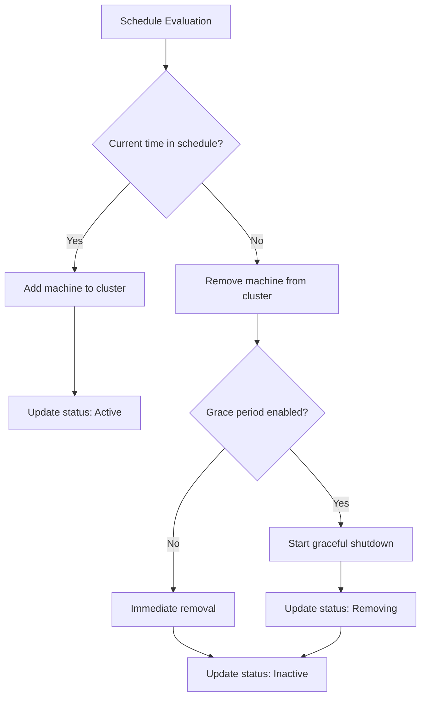

# Concepts Overview

This section covers the core concepts and architecture of 5-Spot.

## What is 5-Spot?

5-Spot is a Kubernetes controller that manages time-based machine scheduling for Cluster API (CAPI) clusters. It automatically adds and removes machines based on configurable time schedules.

## Core Concepts

### ScheduledMachine

The `ScheduledMachine` is the primary Custom Resource that 5-Spot manages. It defines:

- **Schedule**: When the machine should be active (days, hours, timezone)
- **Machine Configuration**: How to connect to and manage the physical machine
- **CAPI References**: Bootstrap and infrastructure templates
- **Lifecycle Settings**: Priority, grace periods, kill switch

### Schedule Evaluation

5-Spot continuously evaluates schedules to determine if machines should be:

- **Active**: Within the scheduled time window
- **Inactive**: Outside the scheduled time window

### Machine Lifecycle

Each ScheduledMachine goes through defined phases:

| Phase | Description |
|-------|-------------|
| **Pending** | Initial state, schedule not yet evaluated |
| **Scheduled** | Within schedule window, being added to cluster |
| **Active** | Machine is running and part of the cluster |
| **Removing** | Grace period, preparing for removal |
| **Inactive** | Machine has been removed |
| **UnScheduled** | Outside schedule window |
| **Error** | An error occurred during processing |

## Architecture Components

- **Controller**: Watches ScheduledMachine resources and reconciles state
- **Schedule Evaluator**: Determines if machines should be active
- **Machine Manager**: Interfaces with CAPI for machine lifecycle
- **Status Reporter**: Updates resource status and conditions

## Learn More

- [Architecture](./architecture.md) - Detailed architecture overview
- [ScheduledMachine](./scheduled-machine.md) - CRD specification
- [Machine Lifecycle](./machine-lifecycle.md) - Phase transitions
- [Schedules](./schedules.md) - Schedule configuration
