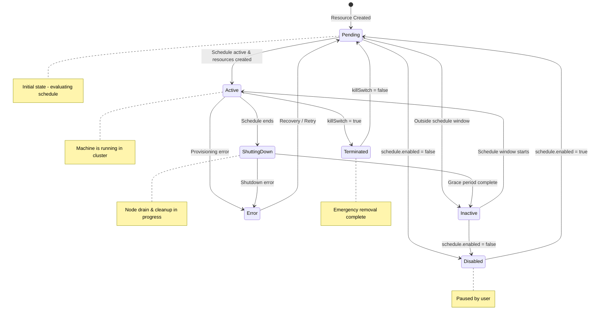
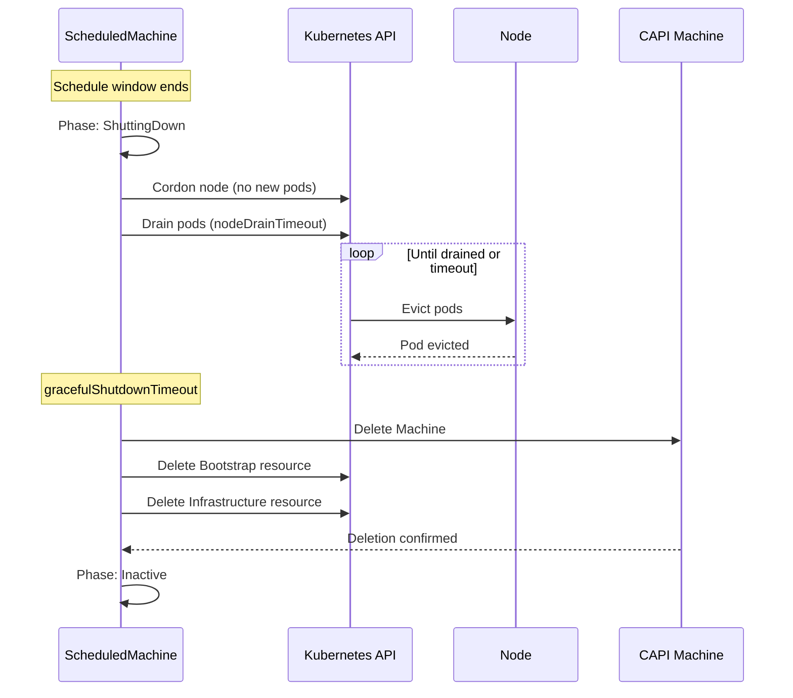
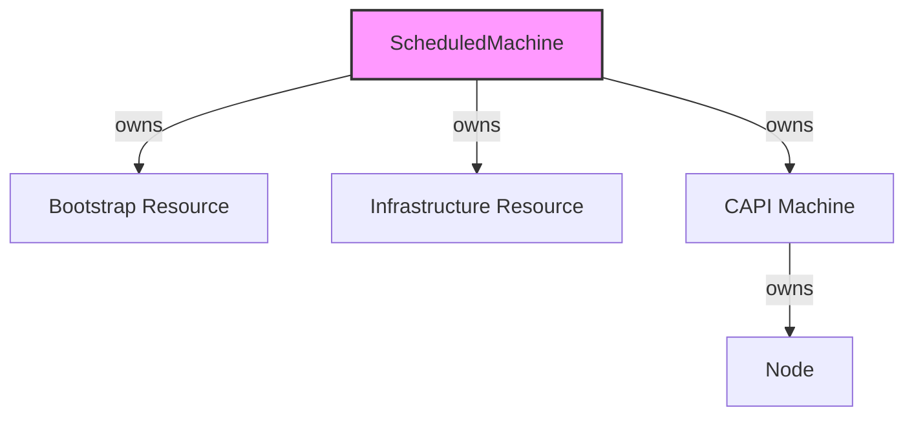

# Machine Lifecycle

ScheduledMachines go through defined phases during their lifecycle.

## Lifecycle Phases



## Phase Descriptions

### Pending

**Initial state** after resource creation.

- Schedule being evaluated
- No CAPI resources created yet
- Transitions based on schedule evaluation and `enabled` flag

### Active

Machine is **running and part of the cluster**.

- Bootstrap resource created
- Infrastructure resource created
- CAPI Machine created and healthy
- Workloads can be scheduled on this machine
- Monitored for health issues

### ShuttingDown

Machine is **being gracefully removed** from the cluster.

- Grace period (`gracefulShutdownTimeout`) is active
- Node being cordoned
- Pods being drained (`nodeDrainTimeout`)
- Waiting for safe removal

### Inactive

Machine has been **completely removed** from the cluster.

- All CAPI resources deleted (Machine, bootstrap, infrastructure)
- Waiting for next schedule window
- No machine exists

### Disabled

Schedule is **disabled** by user (`schedule.enabled: false`).

- No automatic state changes
- Existing machines remain as-is
- Re-enable by setting `schedule.enabled: true`

### Terminated

Machine was **immediately removed** via kill switch (`killSwitch: true`).

- Bypassed normal grace period
- Resources forcefully deleted
- Used for emergency situations
- Deactivate by setting `killSwitch: false`

### Error

An **error occurred** during processing.

- Transient errors trigger automatic retry with backoff
- Permanent errors may require manual intervention
- Details available in status conditions

## Phase Transitions

### Normal Flow (Business Hours Example)

```
08:59 AM: Pending → (schedule check)
09:00 AM: Pending → Active (create Machine, bootstrap, infra)
05:00 PM: Active → ShuttingDown (drain node, grace period)
05:05 PM: ShuttingDown → Inactive (cleanup complete)
09:00 AM next day: Inactive → Active (new schedule window)
```

### Kill Switch Flow

```
Any Phase → Terminated (immediate, bypassing grace period)
Terminated → Pending (when killSwitch set back to false)
```

### Schedule Disabled Flow

```
Any Phase → Disabled (when enabled: false)
Disabled → Pending (when enabled: true, re-evaluate schedule)
```

### Error Recovery

```
Error → Pending (after retry backoff, up to 5 min max)
```

## Conditions

Each phase is accompanied by detailed conditions:

| Type | Description |
|------|-------------|
| `Ready` | Overall readiness status |
| `Scheduled` | Whether within schedule window |
| `MachineReady` | CAPI Machine health status |
| `ReferencesValid` | Bootstrap/Infrastructure spec validation |

### Condition Example

```yaml
status:
  phase: Active
  inSchedule: true
  message: Machine is healthy and running
  machineRef:
    apiVersion: cluster.x-k8s.io/v1beta1
    kind: Machine
    name: business-hours-worker-machine
    namespace: default
  bootstrapRef:
    apiVersion: bootstrap.cluster.x-k8s.io/v1beta1
    kind: K0sWorkerConfig
    name: business-hours-worker-bootstrap
    namespace: default
  infrastructureRef:
    apiVersion: infrastructure.cluster.x-k8s.io/v1beta1
    kind: RemoteMachine
    name: business-hours-worker-infra
    namespace: default
  nodeRef:
    name: worker-node-01
  conditions:
    - type: Ready
      status: "True"
      reason: MachineRunning
      message: Machine is healthy and running
      lastTransitionTime: "2025-01-15T09:00:00Z"
    - type: Scheduled
      status: "True"
      reason: ScheduleActive
      message: "Current time is within schedule: mon-fri 9-17"
      lastTransitionTime: "2025-01-15T09:00:00Z"
    - type: MachineReady
      status: "True"
      reason: MachineReady
      message: CAPI Machine is in Running state
      lastTransitionTime: "2025-01-15T09:01:00Z"
```

## Grace Period & Node Drain

When transitioning from Active to ShuttingDown:



### Timeout Configuration

```yaml
spec:
  # Time to wait for pods to drain from the node
  nodeDrainTimeout: 5m
  
  # Total time for graceful shutdown (includes drain)
  gracefulShutdownTimeout: 5m
```

## Resource Ownership

5-Spot uses Kubernetes owner references for automatic cleanup:



When a ScheduledMachine is deleted, all owned resources are automatically garbage collected.

## Related

- [ScheduledMachine](./scheduled-machine.md) - CRD specification
- [Schedules](./schedules.md) - Schedule configuration
- [Troubleshooting](../operations/troubleshooting.md) - Common issues
