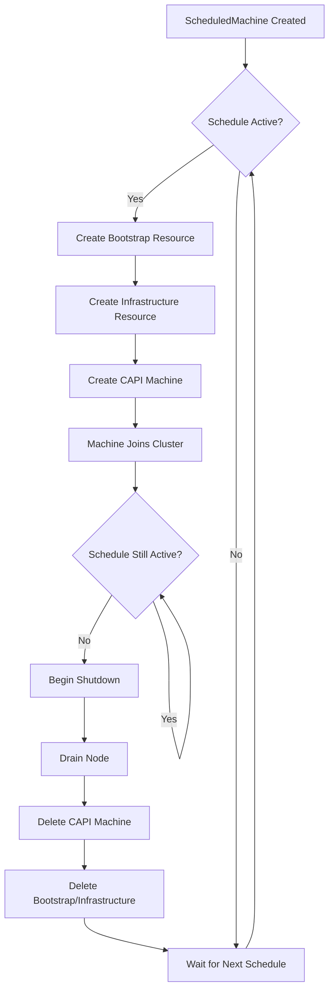

# ScheduledMachine

The `ScheduledMachine` Custom Resource Definition (CRD) is the primary API for 5-Spot.

## Overview

A ScheduledMachine defines:

- When a machine should be active (schedule)
- Inline bootstrap and infrastructure specs (CAPI resources created on-demand)
- Lifecycle behavior (priority, grace period, kill switch)

## Example

```yaml
apiVersion: 5spot.finos.org/v1alpha1
kind: ScheduledMachine
metadata:
  name: business-hours-worker
  namespace: default
spec:
  schedule:
    daysOfWeek:
      - mon-fri
    hoursOfDay:
      - 9-17
    timezone: America/New_York
    enabled: true
  
  # Inline bootstrap configuration
  bootstrapSpec:
    apiVersion: bootstrap.cluster.x-k8s.io/v1beta1
    kind: K0sWorkerConfig
    spec:
      version: v1.30.0+k0s.0
  
  # Inline infrastructure configuration
  infrastructureSpec:
    apiVersion: infrastructure.cluster.x-k8s.io/v1beta1
    kind: RemoteMachine
    spec:
      address: 192.168.1.100
      port: 22
      user: admin
      useSudo: true
  
  clusterName: production-cluster
  priority: 50
  gracefulShutdownTimeout: 5m
  nodeDrainTimeout: 5m
  killSwitch: false
```

## Spec Fields

### schedule

Defines when the machine should be active. Supports either cron expressions or day/hour ranges.

| Field | Type | Required | Default | Description |
|-------|------|----------|---------|-------------|
| `cron` | `string` | No | - | Cron expression (takes precedence over day/hour ranges) |
| `daysOfWeek` | `[]string` | No* | `[]` | Days when active. Supports ranges and lists. |
| `hoursOfDay` | `[]string` | No* | `[]` | Hours when active (0-23). Supports ranges. |
| `timezone` | `string` | No | `UTC` | IANA timezone for schedule evaluation. |
| `enabled` | `bool` | No | `true` | Whether the schedule is enabled. |

*Either `cron` OR `daysOfWeek`/`hoursOfDay` must be specified.

#### Cron Expression

When a cron expression is provided, it takes precedence over `daysOfWeek`/`hoursOfDay`:

```yaml
schedule:
  cron: "0 9-17 * * 1-5"  # Mon-Fri 9am-5pm
  timezone: America/New_York
  enabled: true
```

#### Day Format

- Single day: `mon`, `tue`, `wed`, `thu`, `fri`, `sat`, `sun`
- Range: `mon-fri`, `sat-sun`
- Mixed: `mon-wed,fri`

#### Hour Format

- Single hour: `9`, `14`, `22`
- Range: `9-17` (inclusive of both start and end)
- Mixed: `0-9,17-23`

### bootstrapSpec

Inline bootstrap configuration spec. This resource is created when the schedule is active.

| Field | Type | Required | Description |
|-------|------|----------|-------------|
| `apiVersion` | `string` | Yes | API version (e.g., `bootstrap.cluster.x-k8s.io/v1beta1`) |
| `kind` | `string` | Yes | Kind of bootstrap resource (e.g., `K0sWorkerConfig`) |
| `namespace` | `string` | No | Namespace for created resource (defaults to ScheduledMachine namespace) |
| `spec` | `object` | Yes | Provider-specific spec (e.g., K0sWorkerConfig spec) |

### infrastructureSpec

Inline infrastructure configuration spec. This resource is created when the schedule is active.

| Field | Type | Required | Description |
|-------|------|----------|-------------|
| `apiVersion` | `string` | Yes | API version (e.g., `infrastructure.cluster.x-k8s.io/v1beta1`) |
| `kind` | `string` | Yes | Kind of infrastructure resource (e.g., `RemoteMachine`) |
| `namespace` | `string` | No | Namespace for created resource (defaults to ScheduledMachine namespace) |
| `spec` | `object` | Yes | Provider-specific spec (e.g., RemoteMachine spec) |

### machineTemplate (Optional)

Optional configuration applied to the created CAPI Machine.

| Field | Type | Required | Default | Description |
|-------|------|----------|---------|-------------|
| `labels` | `map[string]string` | No | `{}` | Labels to apply to the created Machine |
| `annotations` | `map[string]string` | No | `{}` | Annotations to apply to the created Machine |

### Other Fields

| Field | Type | Required | Default | Description |
|-------|------|----------|---------|-------------|
| `clusterName` | `string` | Yes | - | Name of the CAPI cluster. |
| `priority` | `int` | No | `50` | Priority (0-100). Higher = more important. |
| `gracefulShutdownTimeout` | `string` | No | `5m` | Time for graceful machine shutdown. |
| `nodeDrainTimeout` | `string` | No | `5m` | Timeout for draining the node before deletion. |
| `killSwitch` | `bool` | No | `false` | Immediately remove machine if true. |

## Status Fields

The status subresource contains the current state:

| Field | Type | Description |
|-------|------|-------------|
| `phase` | `string` | Current lifecycle phase (Pending, Active, ShuttingDown, Inactive, Disabled, Terminated, Error) |
| `message` | `string` | Human-readable status message |
| `inSchedule` | `bool` | Whether currently within scheduled window |
| `conditions` | `[]Condition` | Detailed status conditions |
| `machineRef` | `ObjectReference` | Reference to created CAPI Machine |
| `bootstrapRef` | `ObjectReference` | Reference to created bootstrap resource |
| `infrastructureRef` | `ObjectReference` | Reference to created infrastructure resource |
| `nodeRef` | `LocalObjectReference` | Reference to the Kubernetes Node (once provisioned) |
| `lastScheduledTime` | `Time` | Last time machine was created |
| `nextActivation` | `Time` | Next scheduled activation time |
| `nextCleanup` | `Time` | Time when machine will be cleaned up |
| `observedGeneration` | `int` | Last observed generation |

## How It Works



The controller:

1. Watches for `ScheduledMachine` resources
2. Evaluates schedules against current time (in configured timezone)
3. When schedule is active: creates bootstrap, infrastructure, and Machine resources
4. When schedule ends: gracefully shuts down and cleans up all created resources
5. Maintains owner references for automatic garbage collection

## Related

- [API Reference](../reference/api.md) - Complete API documentation
- [Machine Lifecycle](./machine-lifecycle.md) - Phase transitions
- [Schedules](./schedules.md) - Schedule configuration details
