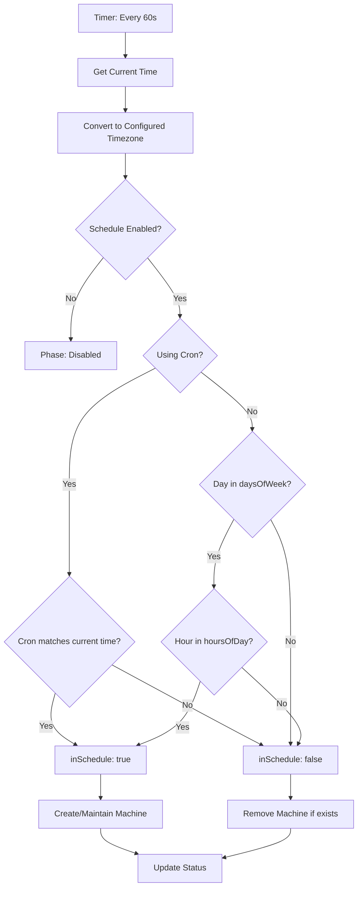

# Schedule Configuration

5-Spot uses flexible schedule configurations to determine when machines should be active.

## Schedule Options

5-Spot supports two scheduling methods:

1. **Cron Expressions** - Standard cron syntax for complex schedules
2. **Day/Hour Ranges** - Simple range-based scheduling

## Cron Expressions

When a `cron` field is specified, it takes precedence over `daysOfWeek`/`hoursOfDay`.

```yaml
schedule:
  cron: "0 9-17 * * 1-5"  # Mon-Fri 9am-5pm
  timezone: America/New_York
  enabled: true
```

### Cron Format

```
┌───────────── minute (0-59)
│ ┌───────────── hour (0-23)
│ │ ┌───────────── day of month (1-31)
│ │ │ ┌───────────── month (1-12)
│ │ │ │ ┌───────────── day of week (0-6, Sun-Sat)
│ │ │ │ │
* * * * *
```

### Cron Examples

| Pattern | Description |
|---------|-------------|
| `0 9-17 * * 1-5` | Mon-Fri 9am-5pm |
| `0 0-8,18-23 * * *` | Night shift (6pm-8am daily) |
| `0 * * * 0,6` | All hours on weekends |
| `0 6-22 * * 1-5` | Extended hours Mon-Fri |
| `0 0 * * *` | Only at midnight |

## Day/Hour Range Syntax

For simpler schedules, use `daysOfWeek` and `hoursOfDay`:

```yaml
schedule:
  daysOfWeek:
    - mon-fri
  hoursOfDay:
    - 9-17
  timezone: America/New_York
  enabled: true
```

## Days of Week

### Supported Values

- `mon`, `tue`, `wed`, `thu`, `fri`, `sat`, `sun`

### Range Syntax

Use a hyphen to specify ranges:

```yaml
daysOfWeek:
  - mon-fri  # Monday through Friday
```

### Multiple Ranges

Combine ranges and individual days:

```yaml
daysOfWeek:
  - mon-wed
  - fri
  - sun
```

### Wrap-Around Ranges

Ranges can wrap around the week:

```yaml
daysOfWeek:
  - fri-mon  # Friday, Saturday, Sunday, Monday
```

### Examples

| Configuration | Active Days |
|---------------|-------------|
| `[mon-fri]` | Monday - Friday |
| `[sat-sun]` | Saturday - Sunday |
| `[mon, wed, fri]` | Monday, Wednesday, Friday |
| `[mon-wed, fri-sun]` | Mon-Wed and Fri-Sun |
| `[fri-tue]` | Fri, Sat, Sun, Mon, Tue (wrap-around) |

## Hours of Day

### Format

Hours are specified in 24-hour format (0-23).

### Range Behavior

Ranges are **inclusive of both start and end**:

```yaml
hoursOfDay:
  - 9-17  # Active from 9:00 to 17:59
```

### Multiple Ranges

```yaml
hoursOfDay:
  - 0-8
  - 18-23
  # Active outside business hours
```

### Wrap-Around Ranges

Hours can wrap around midnight:

```yaml
hoursOfDay:
  - 22-6  # 10pm to 6am (overnight)
```

### Examples

| Configuration | Active Hours |
|---------------|--------------|
| `[9-17]` | 9:00 AM - 5:59 PM |
| `[0-23]` | All day (24 hours) |
| `[0-8, 18-23]` | Night shift |
| `[6-12, 14-20]` | Two shifts with lunch break |
| `[22-6]` | Overnight (10pm - 6am) |

## Timezone

### IANA Timezone Names

Use standard IANA timezone names:

```yaml
timezone: America/New_York
timezone: Europe/London
timezone: Asia/Tokyo
timezone: UTC
```

### Common Timezones

| Timezone | UTC Offset | Region |
|----------|------------|--------|
| `UTC` | +00:00 | Universal |
| `America/New_York` | -05:00 | US Eastern |
| `America/Los_Angeles` | -08:00 | US Pacific |
| `Europe/London` | +00:00 | UK |
| `Europe/Paris` | +01:00 | Central Europe |
| `Asia/Tokyo` | +09:00 | Japan |

### Daylight Saving Time

Timezones automatically handle DST transitions:

- `America/New_York` adjusts for EDT/EST
- `Europe/London` adjusts for BST/GMT

## Enabled Flag

### Disabling Schedules

Set `enabled: false` to pause scheduling without deleting the resource:

```yaml
schedule:
  enabled: false
  # ... other fields preserved
```

When disabled:

- Machine transitions to `Disabled` phase
- Existing active machines remain as-is (no new changes)
- No new activations occur
- Schedule evaluation is skipped

### Use Cases

- **Maintenance windows**: Temporarily disable scheduling
- **Emergency situations**: Quick pause without config changes
- **Testing**: Disable specific machines during tests

## Common Schedule Patterns

### Business Hours (Mon-Fri, 9-5)

```yaml
# Using day/hour ranges
schedule:
  daysOfWeek: [mon-fri]
  hoursOfDay: [9-17]
  timezone: America/New_York

# Using cron
schedule:
  cron: "0 9-17 * * 1-5"
  timezone: America/New_York
```

### 24/7 Operation

```yaml
schedule:
  daysOfWeek: [mon-sun]
  hoursOfDay: [0-23]
  timezone: UTC
```

### Night Shift

```yaml
# Using day/hour ranges (wrap-around)
schedule:
  daysOfWeek: [mon-fri]
  hoursOfDay: [18-23, 0-6]
  timezone: UTC

# Using cron
schedule:
  cron: "0 18-23,0-6 * * 1-5"
  timezone: UTC
```

### Weekend Only

```yaml
schedule:
  daysOfWeek: [sat-sun]
  hoursOfDay: [0-23]
  timezone: UTC
```

### Peak Hours Only

```yaml
schedule:
  daysOfWeek: [mon-fri]
  hoursOfDay: [8-10, 16-18]
  timezone: America/Los_Angeles
```

### First Week of Month Only

```yaml
# Cron is required for this pattern
schedule:
  cron: "0 9-17 1-7 * 1-5"  # Mon-Fri 9-5, days 1-7 only
  timezone: America/New_York
```

## Schedule Evaluation

5-Spot evaluates schedules every 60 seconds:



## Choosing Between Cron and Ranges

| Use Case | Recommended | Why |
|----------|-------------|-----|
| Simple business hours | Day/Hour Ranges | More readable |
| Complex patterns | Cron | More flexible |
| Month/day-of-month constraints | Cron | Not possible with ranges |
| Overnight schedules | Either | Ranges support wrap-around |
| Team familiarity with cron | Cron | Leverages existing knowledge |

## Related

- [ScheduledMachine](./scheduled-machine.md) - CRD specification
- [Machine Lifecycle](./machine-lifecycle.md) - Phase transitions
- [API Reference](../reference/api.md) - Complete API documentation
