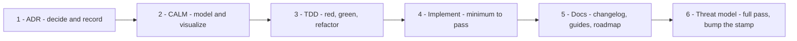

# Developer Guide

5-Spot is built **ADR-first**. Architecture is decided, recorded and visualized
*before* code is written, and the decision record is a first-class deliverable —
equal in importance to the code and the tests. If you are about to change
anything architecturally significant, start here rather than in an editor.

## Architecture Driven Development

The order is fixed. Each step has an artifact and a gate:

| Step | Produces | Lives in | Gate |
|---|---|---|---|
| **1 · ADR** | The decision, with the alternatives you rejected | [`docs/adr/NNNN-title.md`](https://github.com/finos/5-spot/tree/main/docs/adr) | Status / Context / Decision / Consequences, and a row in the ADR index |
| **2 · CALM** | Nodes, relationships, interfaces, flows | `docs/architecture/calm/architecture.json` | `make calm-validate`, then `make calm-diagrams` renders into [System](../architecture/system.md) and [Flows](../architecture/flows.md) |
| **3 · TDD** | A failing test that defines the behaviour | `src/foo_tests.rs` beside `src/foo.rs` | The test fails for the right reason before any implementation exists |
| **4 · Implement** | The minimum code that passes | `src/` | `cargo fmt`, `clippy` and the full test suite, all clean |
| **5 · Docs** | Changelog entry, affected guides, roadmap status | `.claude/CHANGELOG.md`, `docs/src/`, [`ROADMAPS.md`](https://github.com/finos/5-spot/blob/main/ROADMAPS.md) | Docs match the code; a roadmap row reflects reality, not intent |
| **6 · Threat model** | A full pass over every section, and a bumped stamp | [`docs/src/security/threat-model.md`](../security/threat-model.md) | The **Covers** ADR range names this ADR. "No change" is a conclusion, not a skip — the stamp still moves |

An ADR is not done until the threat-model pass has run — it is the last step, not an afterthought. A change that is not reflected in CALM is not designed yet. A CRD shape change
starts in `src/crd.rs` — the source of truth — and regenerates with `make crds`
then `make crddoc`; the YAML under `deploy/crds/` is generated and never
hand-edited.

### When does it apply?

**Full ADR + CALM** — new CRDs or CRD fields that change a contract; new
controllers, reconcilers or binaries; changes to the CAPI interaction (Machine,
bootstrap or infrastructure contract, allowed API groups); deploy, admission or
GitOps topology; and cross-cutting concerns such as security boundaries, RBAC
posture, failure domains or scheduling semantics.

**ADR only, no CALM** — process and policy decisions that change no system
topology: methodology, CI policy, repository conventions. Say so explicitly in
the ADR's Consequences.

**Neither** — typos, comment tweaks, formatting, isolated bug fixes with no
architectural impact, and mechanical refactors that preserve behaviour. These
still follow TDD.

> When you are unsure whether a change is architectural, **write the ADR.** A
> short, slightly redundant ADR costs little. An undocumented architectural
> decision costs the next person a re-derivation.

## The decision log

ADRs are **never rewritten.** A decision that no longer holds is marked
*Superseded* and links forward to the one that replaced it, so the log reads as
a history rather than a snapshot — check the **Status** line before you rely on
one. The canonical index is
[`docs/adr/README.md`](https://github.com/finos/5-spot/blob/main/docs/adr/README.md);
the table below is a convenience copy.

| ADR | Decision | Status |
|---:|---|---|
| [0001](https://github.com/finos/5-spot/blob/main/docs/adr/0001-adopt-architecture-driven-development.md) | Adopt Architecture Driven Development | Accepted |
| [0002](https://github.com/finos/5-spot/blob/main/docs/adr/0002-kata-config-delivery-via-spec-kata.md) | Kata config delivery via `spec.kata`, resolved in the workload cluster | Accepted |
| [0003](https://github.com/finos/5-spot/blob/main/docs/adr/0003-in-pod-host-service-restart-via-nsenter.md) | In-pod host k0s-service restart via `nsenter` | Accepted |
| [0004](https://github.com/finos/5-spot/blob/main/docs/adr/0004-agent-pod-security-exception-boundary-vap.md) | Agent pod-security exception boundary, deny-by-default | Accepted |
| [0005](https://github.com/finos/5-spot/blob/main/docs/adr/0005-remove-kata-destpath-fixed-host-path.md) | Remove `spec.kata.destPath`; fix the host path | Accepted |
| [0006](https://github.com/finos/5-spot/blob/main/docs/adr/0006-pluggable-spot-schedule-provider-contract.md) | Pluggable spot-schedule provider contract | Accepted |
| [0007](https://github.com/finos/5-spot/blob/main/docs/adr/0007-crd-multi-version-and-conversion.md) | CRD multi-version support, additive-only evolution | Accepted |
| [0008](https://github.com/finos/5-spot/blob/main/docs/adr/0008-autovex-presubmission-gate.md) | Auto-VEX signed off before submission, enforced in CI | Accepted |
| [0009](https://github.com/finos/5-spot/blob/main/docs/adr/0009-unify-schedule-as-provider-reference.md) | Unify activation under `spec.schedule` as a provider reference | Accepted |
| [0010](https://github.com/finos/5-spot/blob/main/docs/adr/0010-base-image-pins-on-from-line.md) | Base-image digests pinned on the `FROM` line | Accepted |
| [0011](https://github.com/finos/5-spot/blob/main/docs/adr/0011-schedule-gated-capacity-separate-controller.md) | Schedule-gated capacity in its own controller, scaling rather than creating | Proposed |
| [0012](https://github.com/finos/5-spot/blob/main/docs/adr/0012-kata-agent-validates-its-own-input.md) | The kata-config agent validates its own Node annotation; the restart argv terminates options | Accepted |
| [0013](https://github.com/finos/5-spot/blob/main/docs/adr/0013-kata-config-ref-annotation-admission-policy.md) | The `kata-config-ref` Node annotation is controller-writable only, enforced at admission | Accepted |

Start with **0001** for the methodology, **0006** and **0009** for how
activation works, **0007** before touching a CRD, and **0004** before deploying
into a cluster with a pod-security baseline.

## Where to go next

- [Development Setup](setup.md) — toolchain, `cross`, a local cluster
- [Building](building.md) — binaries, images, the pinned base images
- [Testing](testing.md) — the TDD file pattern and how to run the suite
- [Contributing](contributing.md) — sign-off, commit conventions, review
- [Threat Model](../security/threat-model.md) — what is defended, from whom,
  and with which control in which file. Read it before changing RBAC, admission
  policy or anything the node-side agents touch.
