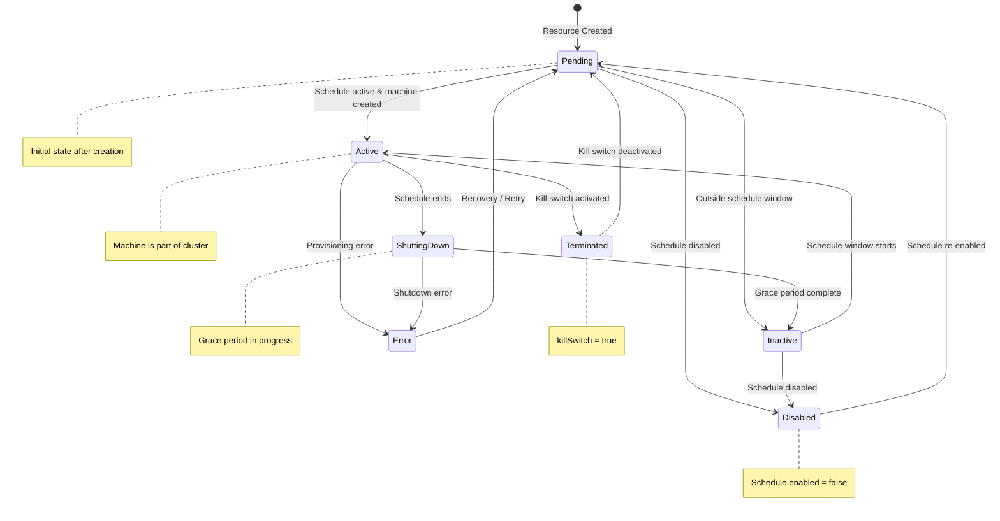

#  Introduction

## CI/CD

[)](https://github.com/finos/5-spot/actions/workflows/build.yaml)
[)](https://github.com/finos/5-spot/actions/workflows/build.yaml)
[)](https://github.com/finos/5-spot/actions/workflows/build.yaml)

**5-Spot** is a cloud-native Kubernetes controller for managing time-based machine scheduling on physical nodes using Cluster API (CAPI). It enables you to automatically add and remove machines from your CAPI clusters based on time schedules, bringing cost optimization and resource efficiency to your infrastructure.

## What is 5-Spot?

5-Spot watches for `ScheduledMachine` Custom Resources in your Kubernetes cluster and automatically manages the lifecycle of physical machines based on configured time schedules. It enables declarative, GitOps-friendly machine scheduling.

### Key Features

- **Time-based Scheduling** - Define when machines should be active using flexible schedules
- **Timezone Support** - Configure schedules in any IANA timezone
- **Flexible Schedules** - Support for day ranges (mon-fri) and hour ranges (9-17)
- **Graceful Shutdown** - Configurable grace periods for safe machine removal
- **Priority-based** - Resource distribution across controller instances
- **Kill Switch** - Emergency immediate removal capability
- **Multi-instance** - Horizontal scaling with consistent hashing
- **Full Observability** - Prometheus metrics and health checks

## Why 5-Spot?

Traditional infrastructure management involves:

- Manual machine provisioning and decommissioning
- No automated time-based scaling
- Wasted resources during off-hours
- Complex multi-region setups
- No audit trail for machine lifecycle

5-Spot transforms this by:

- Managing machines as Kubernetes resources
- Automated time-based machine lifecycle
- Cost optimization during off-peak hours
- Full GitOps workflow support
- Built-in audit trail via Kubernetes events

## Who Should Use 5-Spot?

5-Spot is ideal for:

- **Platform Engineers** managing physical infrastructure with CAPI
- **DevOps Teams** looking to optimize costs through scheduling
- **SREs** requiring automated, auditable machine lifecycle
- **Organizations** with predictable workload patterns
- **Testing Teams** needing scheduled test environments

## Quick Example

Here's how simple it is to create a scheduled machine:

```yaml
apiVersion: 5spot.finos.org/v1alpha1
kind: ScheduledMachine
metadata:
  name: business-hours-machine
  namespace: default
spec:
  schedule:
    daysOfWeek:
      - mon-fri
    hoursOfDay:
      - 9-17
    timezone: America/New_York
    enabled: true

  # Inline bootstrap configuration (e.g., K0sWorkerConfig)
  bootstrapSpec:
    apiVersion: bootstrap.cluster.x-k8s.io/v1beta1
    kind: K0sWorkerConfig
    spec:
      version: v1.30.0+k0s.0

  # Inline infrastructure configuration (e.g., RemoteMachine)
  infrastructureSpec:
    apiVersion: infrastructure.cluster.x-k8s.io/v1beta1
    kind: RemoteMachine
    spec:
      address: 192.168.1.100
      port: 22
      user: admin
      useSudo: true

  clusterName: my-k0s-cluster
  priority: 50
  gracefulShutdownTimeout: 5m
  nodeDrainTimeout: 5m
```

Apply it to your cluster:

```bash
kubectl apply -f scheduled-machine.yaml
```

5-Spot automatically:

1. Evaluates the schedule against the current time
2. Adds the machine to the cluster when within the schedule window
3. Removes the machine gracefully when outside the schedule
4. Updates status and conditions in real-time

## Machine Lifecycle Phases



## Next Steps

- [Quick Start](./installation/quickstart.md) - Get started with 5-Spot quickly
- [Prerequisites](./installation/prerequisites.md) - What you need before installation
- [Architecture Overview](./concepts/architecture.md) - Understand how 5-Spot works
- [API Reference](./reference/api.md) - Complete API documentation

## Project Status

5-Spot is actively developed. The project follows semantic versioning and maintains backward compatibility within major versions.

Current version: **v0.1.0-alpha**

## Support & Community

- **GitHub Issues**: [Report bugs or request features](https://github.com/finos/5-spot/issues)
- **GitHub Discussions**: [Ask questions and share ideas](https://github.com/finos/5-spot/discussions)
- **Documentation**: You're reading it!

## License

5-Spot is open-source software licensed under the [Apache License 2.0](./license.md).
