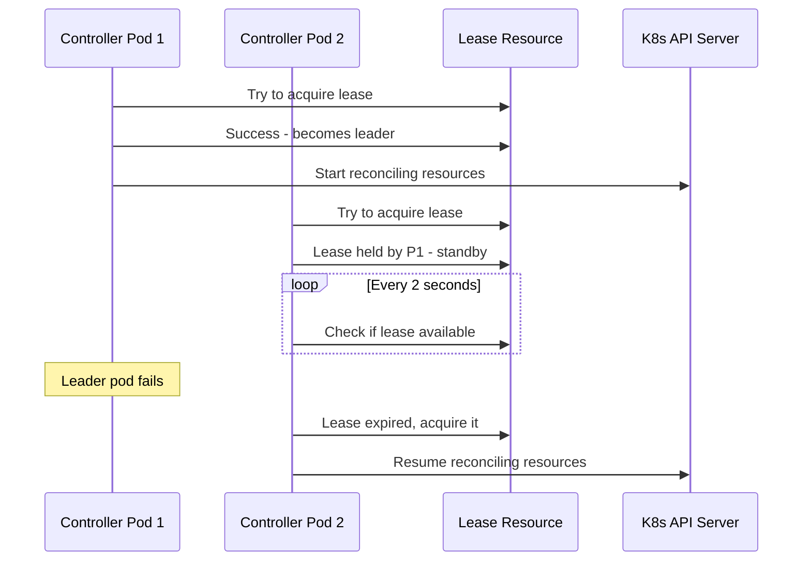

# Multi-Instance Deployment

5-Spot supports running multiple controller instances for high availability using leader election.

## Overview

When running multiple instances with leader election:

- One instance is elected as the **leader** and actively reconciles resources
- Other instances remain on **standby** for automatic failover
- Uses Kubernetes Lease resources for leader election
- Automatic failover within ~15 seconds if leader fails

## Configuration

### Environment Variables

```bash
ENABLE_LEADER_ELECTION=true           # Enable leader election
LEASE_NAME=5spot-leader               # Name of the Lease resource
LEASE_DURATION_SECONDS=15             # Lease validity duration
LEASE_RENEW_DEADLINE_SECONDS=10       # Time to renew before giving up
LEASE_RETRY_PERIOD_SECONDS=2          # Retry interval for acquiring lease
POD_NAME=<pod-name>                   # Injected from downward API
POD_NAMESPACE=<namespace>             # Injected from downward API
```

### Deployment Configuration

Use a standard Deployment (not StatefulSet) with leader election:

```yaml
apiVersion: apps/v1
kind: Deployment
metadata:
  name: 5spot-controller
  namespace: 5spot-system
spec:
  replicas: 2  # Or 3 for higher availability
  selector:
    matchLabels:
      app: 5spot-controller
  template:
    metadata:
      labels:
        app: 5spot-controller
    spec:
      serviceAccountName: 5spot-controller
      containers:
        - name: controller
          image: ghcr.io/firestoned/5spot-rs:latest
          env:
            - name: POD_NAME
              valueFrom:
                fieldRef:
                  fieldPath: metadata.name
            - name: POD_NAMESPACE
              valueFrom:
                fieldRef:
                  fieldPath: metadata.namespace
            - name: ENABLE_LEADER_ELECTION
              value: "true"
            - name: LEASE_NAME
              value: "5spot-leader"
            - name: LEASE_DURATION_SECONDS
              value: "15"
            - name: LEASE_RENEW_DEADLINE_SECONDS
              value: "10"
            - name: LEASE_RETRY_PERIOD_SECONDS
              value: "2"
          # ... rest of container spec
```

## Leader Election Mechanism

### How It Works



### Lease Resource

The lease is stored as a `coordination.k8s.io/v1` Lease resource:

```yaml
apiVersion: coordination.k8s.io/v1
kind: Lease
metadata:
  name: 5spot-leader
  namespace: 5spot-system
spec:
  holderIdentity: 5spot-controller-abc123
  leaseDurationSeconds: 15
  acquireTime: "2024-01-15T10:00:00Z"
  renewTime: "2024-01-15T10:00:05Z"
```

## Scaling Considerations

### Scaling Up

When adding replicas:

1. New pods start in standby mode
2. They attempt to acquire the lease
3. If leader fails, one standby takes over
4. No resource redistribution needed - leader handles all

### Scaling Down

When removing replicas:

1. If a standby pod is removed - no impact
2. If leader pod is removed - automatic failover to standby
3. Failover occurs within `LEASE_DURATION_SECONDS` (default: 15s)

### PodDisruptionBudget

Protect against simultaneous disruptions:

```yaml
apiVersion: policy/v1
kind: PodDisruptionBudget
metadata:
  name: 5spot-controller
  namespace: 5spot-system
spec:
  minAvailable: 1  # Always keep at least one pod running
  selector:
    matchLabels:
      app: 5spot-controller
```

## Monitoring Multi-Instance

### Leader Status Metrics

```promql
# Current leader
five_spot_leader_status{pod="...", is_leader="true"}

# Time since last leader election
five_spot_leader_election_timestamp_seconds
```

### Instance Health

Monitor individual instance health:

```promql
# Pods that are down
count(five_spot_up == 0)

# Alert if leader is down for too long
alert: FiveSpotLeaderDown
expr: five_spot_leader_status{is_leader="true"} == 0
for: 30s
```

## Best Practices

1. **Run 2-3 replicas** for high availability
2. **Use Deployment** (not StatefulSet) with leader election
3. **Configure PDB** to prevent all pods from being evicted
4. **Monitor leader status** to detect election issues
5. **Set appropriate lease duration** - shorter means faster failover but more API calls

## RBAC Requirements

Ensure the service account has permissions to manage leases:

```yaml
rules:
  - apiGroups: ["coordination.k8s.io"]
    resources: ["leases"]
    verbs: ["get", "create", "update", "patch"]
```

## Related

- [Configuration](./configuration.md) - Controller configuration
- [High Availability](../advanced/ha.md) - HA architecture
- [Monitoring](./monitoring.md) - Monitoring setup
