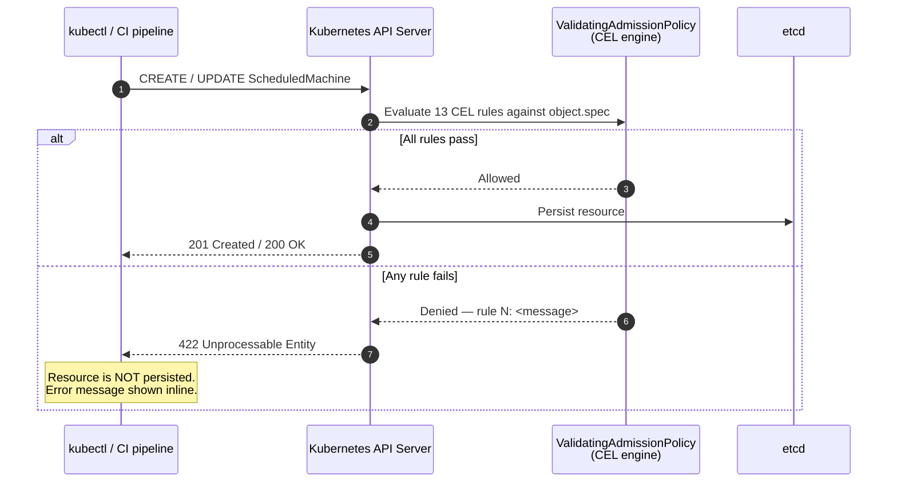

# Admission Validation

5-Spot enforces `ScheduledMachine` spec correctness at API-server admission
time using a Kubernetes **`ValidatingAdmissionPolicy`** (VAP).  Invalid
resources are rejected the moment `kubectl apply` is run — before they are
persisted to etcd or ever seen by the reconciler.

!!! info "Regulatory context"
    Admission-time validation satisfies **NIST 800-53 CM-5** (Access
    Restrictions for Change) by ensuring only well-formed, provider-allowlisted
    specs can be created or updated in the cluster.

---

## Background

### ValidatingAdmissionPolicy vs. ValidatingWebhook

Prior to Kubernetes 1.26, admission-time validation required a
`ValidatingWebhook` — a separate HTTPS server that the API server calls for
every matching request.  Running a webhook adds operational complexity:
TLS certificates, a Deployment to manage, potential availability concerns,
and a `failurePolicy` that determines whether the cluster becomes unusable
if the webhook is down.

`ValidatingAdmissionPolicy` (VAP), introduced in Kubernetes 1.26 (alpha),
1.28 (beta), and GA in 1.30, moves the validation logic **inside the API
server** using CEL (Common Expression Language) expressions.  There is no
sidecar to deploy, no TLS to manage, and no additional availability surface.

| Aspect | `ValidatingWebhook` | `ValidatingAdmissionPolicy` |
|---|---|---|
| Runs inside API server | No — separate pod required | **Yes** |
| TLS certificate required | Yes | **No** |
| Availability risk | Yes — webhook outage can block admission | **No** |
| Logic language | Any (HTTP handler) | **CEL expressions** |
| Kubernetes version | All | ≥ 1.26 (alpha), ≥ 1.28 (beta), ≥ 1.30 (GA) |
| Cross-field validation | Yes | **Yes** (via CEL `has()` and combinators) |
| Dynamic parameters | Via `ParamKind` | Yes |

5-Spot uses VAP because it eliminates the operational overhead of a webhook
server while providing equivalent (and in some respects stronger) validation
guarantees.

---

## How Admission Validation Works



The policy is bound to **all namespaces** by default via a
`ValidatingAdmissionPolicyBinding` with `validationActions: [Deny]`.
The binding can be scoped to specific namespaces if needed — see
[Namespace Scoping](#namespace-scoping).

---

## Validation Rules

The policy contains 13 CEL validation rules.  Every rule must pass for the
request to be admitted.  Rules are evaluated against `object` (the incoming
resource) in the order listed.

| # | Field(s) | Rule | Error message |
|---|---|---|---|
| 1 | `spec.clusterName` | Must not be empty | `spec.clusterName must not be empty` |
| 2 | `spec.gracefulShutdownTimeout` | Must match `^\d+[smh]$` | `must be a duration string such as '5m', '30s', or '1h'` |
| 3 | `spec.nodeDrainTimeout` | Must match `^\d+[smh]$` | `must be a duration string such as '5m', '30s', or '1h'` |
| 4 | `spec.schedule.cron` + `daysOfWeek`/`hoursOfDay` | If `cron` is set, `daysOfWeek` and `hoursOfDay` must both be empty | `cron is mutually exclusive with daysOfWeek and hoursOfDay` |
| 5 | `spec.schedule` | If `cron` is absent, both `daysOfWeek` and `hoursOfDay` must be non-empty | `both daysOfWeek and hoursOfDay must be non-empty` |
| 6 | `spec.schedule.daysOfWeek[]` | Each item matches `mon\|tue\|…` with optional range/combo | `must be day names or ranges (e.g. 'mon', 'mon-fri', 'mon-wed,fri-sun')` |
| 7 | `spec.schedule.hoursOfDay[]` | Each item matches `\d{1,2}(-\d{1,2})?` with optional combo | `must be hours or ranges (e.g. '9', '9-17', '0-9,18-23')` |
| 8 | `spec.bootstrapSpec.apiVersion` | Must contain `/` — core API versions (`v1`) are rejected | `must use a namespaced API group` |
| 9 | `spec.bootstrapSpec.apiVersion` | Group must be `bootstrap.cluster.x-k8s.io` or `k0smotron.io` | `must be from an allowed group` |
| 10 | `spec.bootstrapSpec.kind` | Must not be empty | `spec.bootstrapSpec.kind must not be empty` |
| 11 | `spec.infrastructureSpec.apiVersion` | Must contain `/` | `must use a namespaced API group` |
| 12 | `spec.infrastructureSpec.apiVersion` | Group must be `infrastructure.cluster.x-k8s.io` or `k0smotron.io` | `must be from an allowed group` |
| 13 | `spec.infrastructureSpec.kind` | Must not be empty | `spec.infrastructureSpec.kind must not be empty` |

### Rule details

#### Rules 2–3 — Duration format

The `gracefulShutdownTimeout` and `nodeDrainTimeout` fields accept strings
of the form `<positive-integer><unit>` where unit is `s`, `m`, or `h`.
These rules enforce the same constraint as `parse_duration()` in the
reconciler, catching malformed values (e.g., `"five minutes"`, `"5 m"`,
`""`) before any reconciliation runs.

```yaml
gracefulShutdownTimeout: "5m"   # ✅  valid
gracefulShutdownTimeout: "30s"  # ✅  valid
gracefulShutdownTimeout: "1h"   # ✅  valid
gracefulShutdownTimeout: "5"    # ❌  rejected — no unit
gracefulShutdownTimeout: "5 m"  # ❌  rejected — space not allowed
gracefulShutdownTimeout: "five" # ❌  rejected — not a number
```

#### Rules 4–5 — Cron XOR explicit windows

`spec.schedule.cron` and the explicit `daysOfWeek`/`hoursOfDay` window are
**mutually exclusive**.  When a cron expression is provided the controller
ignores `daysOfWeek` and `hoursOfDay`; rule 4 rejects specs that set both
to prevent silent data loss.  Rule 5 ensures that when cron is absent, the
explicit window is complete — a schedule with only days and no hours (or
vice versa) is not meaningful.

```yaml
# ✅ Valid — cron only
schedule:
  cron: "0 9-17 * * 1-5"
  timezone: "America/Toronto"
  enabled: true

# ✅ Valid — explicit window
schedule:
  daysOfWeek: ["mon-fri"]
  hoursOfDay: ["9-17"]
  timezone: "America/Toronto"
  enabled: true

# ❌ Rejected by rule 4 — cron + explicit window
schedule:
  cron: "0 9-17 * * 1-5"
  daysOfWeek: ["mon-fri"]     # must be empty when cron is set
  hoursOfDay: ["9-17"]

# ❌ Rejected by rule 5 — explicit window incomplete
schedule:
  daysOfWeek: ["mon-fri"]
  # hoursOfDay missing — rule 5 rejects this
```

#### Rules 8–9, 11–12 — Provider API group allowlist

The `bootstrapSpec.apiVersion` and `infrastructureSpec.apiVersion` fields
must reference an explicitly allowed CAPI provider group.  This mirrors the
`validate_api_group()` runtime check in the reconciler and provides
defence-in-depth: an attacker who can create `ScheduledMachine` resources
cannot use them to create arbitrary Kubernetes resources (e.g.,
`apiVersion: rbac.authorization.k8s.io/v1, kind: ClusterRole`).

| Provider | Allowed `bootstrapSpec.apiVersion` prefix | Allowed `infrastructureSpec.apiVersion` prefix |
|---|---|---|
| Cluster API (upstream) | `bootstrap.cluster.x-k8s.io/` | `infrastructure.cluster.x-k8s.io/` |
| k0smotron | `k0smotron.io/` | `k0smotron.io/` |

To add a new provider, update both the `ValidatingAdmissionPolicy`
(rules 9 and 12) and the constants in `src/constants.rs`
(`ALLOWED_BOOTSTRAP_API_GROUPS`, `ALLOWED_INFRASTRUCTURE_API_GROUPS`).

---

## Deployment

### Prerequisites

- Kubernetes **≥ 1.26** (alpha — requires feature gate `ValidatingAdmissionPolicy=true`)
- Kubernetes **≥ 1.28** (beta — enabled by default)
- Kubernetes **≥ 1.30** (stable — GA, no feature gate required)

Check your cluster version:

```bash
kubectl version --short
```

For Kubernetes 1.26–1.27, enable the feature gate on the API server:

```yaml
# kube-apiserver flags
--feature-gates=ValidatingAdmissionPolicy=true
```

### Apply the manifests

The policy and binding are two separate resources in `deploy/admission/`.
Apply the policy first, then the binding:

```bash
kubectl apply -f deploy/admission/validatingadmissionpolicy.yaml
kubectl apply -f deploy/admission/validatingadmissionpolicybinding.yaml
```

### Verify the policy is active

```bash
# List the policy and confirm it is accepted
kubectl get validatingadmissionpolicy scheduledmachine-validation

# List the binding
kubectl get validatingadmissionpolicybinding scheduledmachine-validation-binding

# Inspect the policy rules
kubectl describe validatingadmissionpolicy scheduledmachine-validation
```

Expected output includes `Type Ready` condition in the `Status` section.

---

## Rollout Strategy

!!! warning "Use Audit mode during initial rollout"
    Switching directly to `Deny` on an existing cluster may block legitimate
    resources that were created before the policy was deployed.  Always use
    `Audit` mode first to detect violations without blocking traffic.

### Phase 1 — Audit (observe without blocking)

Edit the binding to use `Audit` instead of `Deny`:

```yaml
spec:
  policyName: scheduledmachine-validation
  validationActions: [Audit]   # log violations, do NOT reject
  matchResources:
    namespaceSelector: {}
```

Apply and monitor the API server audit log for `FailedAdmissionValidation`
events:

```bash
kubectl get events -A --field-selector reason=FailedAdmissionValidation
```

Resolve any violations in existing resources before proceeding to phase 2.

### Phase 2 — Deny (enforce)

Once no audit violations are observed, switch to `Deny`:

```yaml
spec:
  validationActions: [Deny]
```

```bash
kubectl apply -f deploy/admission/validatingadmissionpolicybinding.yaml
```

### Phase 3 — AuditAndDeny (belt and braces)

For maximum observability during steady state, use both:

```yaml
validationActions: [Deny, Audit]
```

This blocks invalid requests **and** produces an audit log entry for every
attempted violation, which is useful for SIEM alerting.

---

## Testing

### Test with a valid spec

```bash
kubectl apply -f - <<'EOF'
apiVersion: 5spot.finos.org/v1alpha1
kind: ScheduledMachine
metadata:
  name: test-valid
  namespace: default
spec:
  clusterName: my-cluster
  schedule:
    daysOfWeek: ["mon-fri"]
    hoursOfDay: ["9-17"]
    timezone: "America/Toronto"
    enabled: true
  bootstrapSpec:
    apiVersion: k0smotron.io/v1beta1
    kind: K0sWorkerConfig
    spec: {}
  infrastructureSpec:
    apiVersion: infrastructure.cluster.x-k8s.io/v1beta1
    kind: RemoteMachine
    spec: {}
  gracefulShutdownTimeout: "5m"
  nodeDrainTimeout: "10m"
EOF
```

Expected: `scheduledmachine.5spot.finos.org/test-valid created`

### Test invalid duration format (rules 2–3)

```bash
kubectl apply -f - <<'EOF'
apiVersion: 5spot.finos.org/v1alpha1
kind: ScheduledMachine
metadata:
  name: test-bad-duration
  namespace: default
spec:
  clusterName: my-cluster
  schedule:
    daysOfWeek: ["mon-fri"]
    hoursOfDay: ["9-17"]
    timezone: "UTC"
    enabled: true
  bootstrapSpec:
    apiVersion: k0smotron.io/v1beta1
    kind: K0sWorkerConfig
    spec: {}
  infrastructureSpec:
    apiVersion: infrastructure.cluster.x-k8s.io/v1beta1
    kind: RemoteMachine
    spec: {}
  gracefulShutdownTimeout: "five minutes"   # ❌ invalid
  nodeDrainTimeout: "10m"
EOF
```

Expected error:

```
The ScheduledMachine "test-bad-duration" is invalid:
  spec.gracefulShutdownTimeout: Invalid value: "five minutes": must be a
  duration string such as '5m', '30s', or '1h' ...
```

### Test forbidden API group (rules 9, 12)

```bash
kubectl apply -f - <<'EOF'
apiVersion: 5spot.finos.org/v1alpha1
kind: ScheduledMachine
metadata:
  name: test-bad-apigroup
  namespace: default
spec:
  clusterName: my-cluster
  schedule:
    daysOfWeek: ["mon-fri"]
    hoursOfDay: ["9-17"]
    timezone: "UTC"
    enabled: true
  bootstrapSpec:
    apiVersion: rbac.authorization.k8s.io/v1   # ❌ not an allowed group
    kind: ClusterRole
    spec: {}
  infrastructureSpec:
    apiVersion: infrastructure.cluster.x-k8s.io/v1beta1
    kind: RemoteMachine
    spec: {}
  gracefulShutdownTimeout: "5m"
  nodeDrainTimeout: "10m"
EOF
```

Expected error:

```
The ScheduledMachine "test-bad-apigroup" is invalid:
  spec.bootstrapSpec.apiVersion: Invalid value: ...: must be from an allowed
  group: bootstrap.cluster.x-k8s.io or k0smotron.io
```

### Test cron + explicit window conflict (rule 4)

```bash
kubectl apply -f - <<'EOF'
apiVersion: 5spot.finos.org/v1alpha1
kind: ScheduledMachine
metadata:
  name: test-cron-conflict
  namespace: default
spec:
  clusterName: my-cluster
  schedule:
    cron: "0 9-17 * * 1-5"
    daysOfWeek: ["mon-fri"]     # ❌ must be empty when cron is set
    hoursOfDay: ["9-17"]
    timezone: "UTC"
    enabled: true
  bootstrapSpec:
    apiVersion: k0smotron.io/v1beta1
    kind: K0sWorkerConfig
    spec: {}
  infrastructureSpec:
    apiVersion: infrastructure.cluster.x-k8s.io/v1beta1
    kind: RemoteMachine
    spec: {}
  gracefulShutdownTimeout: "5m"
  nodeDrainTimeout: "10m"
EOF
```

Expected error:

```
The ScheduledMachine "test-cron-conflict" is invalid:
  spec.schedule: Invalid value: ...: cron is mutually exclusive with
  daysOfWeek and hoursOfDay — set one or the other, not both
```

---

## Namespace Scoping

By default the binding applies to **all namespaces**.  To restrict enforcement
to specific namespaces, add a `namespaceSelector` to the binding:

```yaml
spec:
  policyName: scheduledmachine-validation
  validationActions: [Deny]
  matchResources:
    namespaceSelector:
      matchLabels:
        5spot.eribourg.dev/managed: "true"
```

Then label the namespaces where `ScheduledMachine` resources are permitted:

```bash
kubectl label namespace my-workload-ns 5spot.eribourg.dev/managed=true
```

!!! tip
    In production environments, combining a `namespaceSelector` on the
    binding with a `ResourceQuota` on the target namespaces (limiting the
    number of `ScheduledMachine` resources per namespace) provides layered
    admission controls with minimal blast radius.

---

## Kubernetes Version Compatibility

| Kubernetes version | VAP status | Action required |
|---|---|---|
| < 1.26 | Not available | Use `ValidatingWebhook` or upgrade cluster |
| 1.26 – 1.27 | Alpha | Enable `--feature-gates=ValidatingAdmissionPolicy=true` on API server |
| 1.28 – 1.29 | Beta — enabled by default | No action required |
| ≥ 1.30 | GA (stable) | No action required |

Check whether VAP is available in your cluster:

```bash
kubectl api-resources | grep validatingadmissionpolic
```

If the command returns results, VAP is available.

---

## See Also

- [Threat Model](threat-model.md) — full STRIDE analysis and residual risks
- [API Reference](../reference/api.md) — complete `ScheduledMachine` field reference
- [CAPI Integration](../advanced/capi-integration.md) — bootstrap and infrastructure provider details
- [Compliance Roadmap](../../roadmaps/compliance-sox-basel3-nist.md) — NIST CM-5 and other regulatory control status
- Kubernetes documentation: [ValidatingAdmissionPolicy](https://kubernetes.io/docs/reference/access-authn-authz/validating-admission-policy/)
