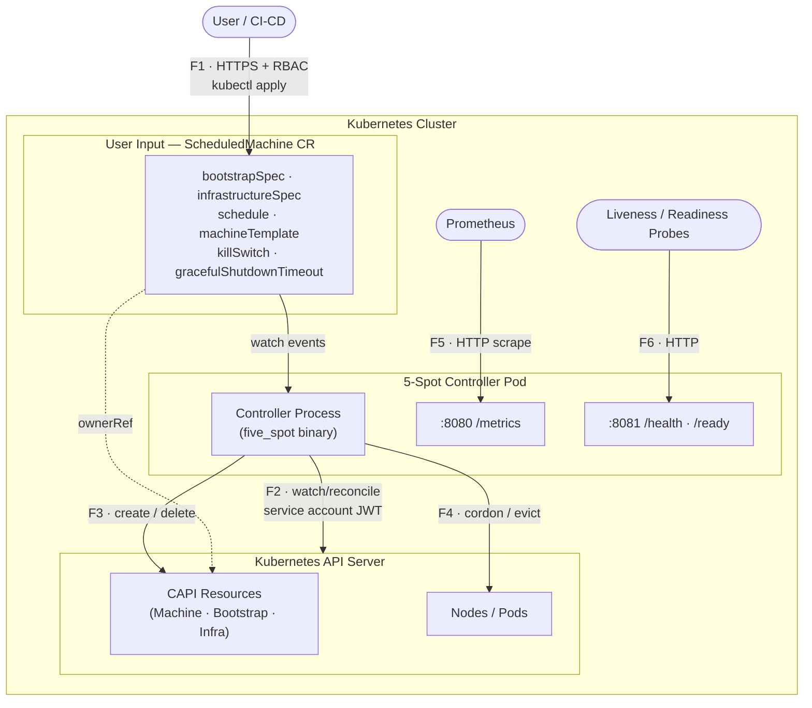
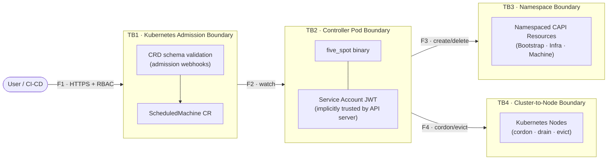

# Threat Model: 5-Spot ScheduledMachine Controller

**Version:** 1.0  
**Date:** 2026-04-08  
**Status:** Active  
**Classification:** Internal — Security Sensitive

---

## 1. Document Scope

This threat model covers the **5-Spot controller** — a Kubernetes operator that manages the lifecycle of physical machines in k0smotron-backed CAPI clusters based on configurable time schedules.

It identifies assets, trust boundaries, threat actors, per-component STRIDE threats, current mitigations, and residual risk. It is intended to inform security reviews, deployment hardening decisions, and future development.

**In scope:**
- The controller process (`five_spot` binary) and its Kubernetes RBAC surface
- The `ScheduledMachine` Custom Resource Definition and its admission path
- All Kubernetes API interactions (CAPI Machine, Bootstrap, Infrastructure, Nodes, Pods)
- The metrics (`/metrics`) and health (`/health`, `/ready`) HTTP endpoints

**Out of scope:**
- The underlying k0smotron / CAPI infrastructure providers
- The physical machines being managed
- The Kubernetes API server itself
- Network-level threats (CNI, firewall policy)

---

## 2. System Overview



### Key Data Flows

| Flow | Description | Protocol | Auth |
|---|---|---|---|
| F1 | User → API Server: create/update ScheduledMachine | HTTPS | Kubernetes RBAC |
| F2 | Controller → API Server: watch ScheduledMachine events | HTTPS/Watch | Service account JWT |
| F3 | Controller → API Server: create/delete CAPI resources | HTTPS | Service account JWT |
| F4 | Controller → API Server: cordon Node, evict Pods | HTTPS | Service account JWT |
| F5 | Prometheus → Controller: scrape metrics | HTTP (no TLS) | None (cluster-internal) |
| F6 | Kubernetes probes → Controller: health checks | HTTP (no TLS) | None (cluster-internal) |

---

## 3. Assets

| Asset | Sensitivity | Description |
|---|---|---|
| **Physical machine availability** | Critical | Machines being added/removed from cluster; unintended removal causes workload disruption |
| **CAPI cluster integrity** | Critical | Bootstrap and infrastructure resources that define cluster membership |
| **Node workloads** | High | Running pods that could be evicted during a drain operation |
| **Controller service account credentials** | High | JWT token granting cluster-wide RBAC privileges |
| **ScheduledMachine spec data** | Medium | Contains infrastructure topology (addresses, ports, SSH config) |
| **Kubernetes RBAC posture** | High | Overly broad permissions on the service account expand blast radius of compromise |
| **Cluster-wide node state** | High | Cordon/drain operations affect all workloads on targeted nodes |

---

## 4. Trust Boundaries



---

## 5. Threat Actors

| Actor | Capability | Motivation |
|---|---|---|
| **Malicious tenant** | Can create/edit ScheduledMachines in their namespace | Escape namespace, disrupt other tenants, exfiltrate data |
| **Compromised CI/CD** | Can push images or apply manifests | Backdoor controller binary, escalate privileges |
| **Compromised controller pod** | Has the controller's service account | Lateral movement to CAPI resources, node disruption |
| **Rogue operator** | Internal user with broad kubectl access | Misuse kill switch, drain nodes during business hours |
| **Supply chain attacker** | Can inject into upstream crates (kube-rs, serde, etc.) | RCE inside controller, credential theft |

---

## 6. STRIDE Threat Analysis

### 6.1 ScheduledMachine Custom Resource (Trust Boundary: TB1)

#### Spoofing
| ID | Threat | Likelihood | Impact | Status |
|---|---|---|---|---|
| S1 | User crafts a ScheduledMachine that mimics another tenant's resource name to confuse monitoring/alerting | Low | Low | Accepted — names are unique within namespace |
| S2 | Attacker spoofs `ownerReference` UID to claim ownership of existing resources | Low | Medium | Mitigated — UID is set server-side by the controller, not from user input |

#### Tampering
| ID | Threat | Likelihood | Impact | Status |
|---|---|---|---|---|
| T1 | **Cross-namespace resource creation** — user sets `bootstrapSpec.namespace` to `kube-system` | High | Critical | **Mitigated (2026-04-08)** — `namespace` field removed from `EmbeddedResource`; controller always uses SM's own namespace |
| T2 | **Label injection** — user sets `machineTemplate.labels["cluster.x-k8s.io/cluster-name"]` to redirect machine to attacker-controlled cluster | High | Critical | **Mitigated (2026-04-08)** — `validate_labels()` blocks reserved prefixes |
| T3 | **Annotation injection** — user injects `kubectl.kubernetes.io/restartedAt` to trigger rolling restarts | Medium | Medium | **Mitigated (2026-04-08)** — same prefix allowlist |
| T4 | **apiVersion/kind injection** — user sets `bootstrapSpec.kind: ClusterRole` to create RBAC resources | High | High | **Mitigated (2026-04-08)** — `validate_api_group()` enforces allowlist |
| T5 | User injects malicious content into `bootstrapSpec.spec` or `infrastructureSpec.spec` targeting provider vulnerabilities | Medium | High | **Partially mitigated** — spec content is passed opaquely to providers; provider-side validation is out of scope |
| T6 | **Timezone log injection** — user injects newlines/control chars into timezone field to poison structured logs | Low | Low | **Mitigated (2026-04-08)** — CRD schema enforces `pattern: ^[A-Za-z][A-Za-z0-9_+\-/]*$` and `maxLength: 64` |
| T7 | **Duration overflow** — user sets `gracefulShutdownTimeout: "9999999999999h"` causing integer overflow | Medium | High | **Mitigated (2026-04-08)** — `checked_mul` + `MAX_DURATION_SECS = 86400` cap |
| T8 | User updates ScheduledMachine spec after machine is active, changing `clusterName` mid-lifecycle | Medium | Medium | **Residual risk** — spec changes trigger reconciliation; no immutability enforcement on `clusterName` |

#### Repudiation
| ID | Threat | Likelihood | Impact | Status |
|---|---|---|---|---|
| R1 | No audit trail when kill switch is activated | Medium | High | **Residual risk** — Kubernetes audit log captures the CR edit, but controller logs only emit a single line; no structured event emitted |
| R2 | No record of which schedule window caused machine removal | Low | Low | Accepted — status conditions record transition timestamps |

#### Information Disclosure
| ID | Threat | Likelihood | Impact | Status |
|---|---|---|---|---|
| I1 | Error messages in `ReconcilerError` echo user-provided values (timezone, duration, API groups) verbatim | Low | Low | **Residual risk** — these are operator-visible logs, not exposed to end users; impact limited |
| I2 | `bootstrapSpec.spec` may contain infrastructure addresses, credentials, or SSH keys in plaintext | High | High | **Residual risk** — see Section 8 |
| I3 | ScheduledMachine status exposes `nodeRef`, `machineRef` — leaks infrastructure topology to namespace readers | Low | Low | Accepted — intentional observability; readers in the same namespace are trusted |

#### Denial of Service
| ID | Threat | Likelihood | Impact | Status |
|---|---|---|---|---|
| D1 | Attacker creates thousands of ScheduledMachines to overwhelm the controller reconciliation queue | Medium | Medium | **Partially mitigated** — Kubernetes resource quotas and admission webhooks can cap CR count; controller has CPU/memory limits |
| D2 | **Finalizer hang** — drain operation never completes, blocking namespace deletion indefinitely | Medium | High | **Mitigated (2026-04-08)** — `tokio::time::timeout(600s)` wraps finalizer cleanup |
| D3 | Crafted cron expression causes ReDoS when cron evaluation is implemented | Low | Medium | **Residual risk** — cron is not yet implemented; must use a safe parser when added |
| D4 | User triggers kill switch repeatedly causing rapid machine add/remove cycles (thrashing) | Low | Medium | Accepted — kill switch is write-once-by-design; no automatic reactivation |

#### Elevation of Privilege
| ID | Threat | Likelihood | Impact | Status |
|---|---|---|---|---|
| E1 | Attacker uses `apiVersion: rbac.authorization.k8s.io/v1, kind: ClusterRole` to create RBAC resources via controller | High | Critical | **Mitigated (2026-04-08)** — API group allowlist |
| E2 | **Compromised controller pod** gains cluster-wide node cordon/drain, CAPI write access | Medium | Critical | **Partially mitigated** — k0smotron.io RBAC narrowed; bootstrap/infra still use wildcards (provider-agnostic requirement) |
| E3 | Controller service account token stolen from pod filesystem | Low | Critical | **Mitigated** — read-only root filesystem; token mounted at standard path (Kubernetes default); no projected service account with long lifetime |

---

### 6.2 Controller Process (Trust Boundary: TB2)

#### Spoofing
| ID | Threat | Likelihood | Impact | Status |
|---|---|---|---|---|
| S3 | Attacker replaces controller image with backdoored binary | Low | Critical | **Residual risk** — mitigated by image signing (release workflow uses Cosign); `IfNotPresent` pull policy means in-cluster image is trusted |

#### Tampering
| ID | Threat | Likelihood | Impact | Status |
|---|---|---|---|---|
| T9 | Memory corruption in unsafe Rust code or via malformed serde input | Very Low | Critical | **Mitigated** — codebase is safe Rust; no `unsafe` blocks; serde handles malformed input with errors |
| T10 | Supply chain attack via malicious crate version | Low | Critical | **Residual risk** — mitigated by Trivy container scan in CI; no automated dependency pinning beyond Cargo.lock |

#### Information Disclosure
| ID | Threat | Likelihood | Impact | Status |
|---|---|---|---|---|
| I4 | `/metrics` endpoint accessible without authentication | Medium | Low | Accepted — metrics contain no secrets; exposes operational data only; restricted to cluster network |
| I5 | Service account token exposed via `RUST_LOG=trace` debug output | Low | Medium | **Residual risk** — `RUST_LOG=debug` set in deployment; kube-rs does not log JWT tokens; verify before production |

#### Denial of Service
| ID | Threat | Likelihood | Impact | Status |
|---|---|---|---|---|
| D5 | Pod eviction during drain exhausts Kubernetes API rate limits (`429` responses from PDB) | Medium | Medium | **Mitigated** — `evict_pod` handles 429 gracefully and logs a warning rather than crashing |

---

### 6.3 Node Drain Path (Trust Boundary: TB4)

#### Tampering
| ID | Threat | Likelihood | Impact | Status |
|---|---|---|---|---|
| T11 | Attacker creates ScheduledMachine whose `clusterName` matches a production cluster, triggering drain of production nodes outside schedule | Medium | Critical | **Partially mitigated** — `clusterName` is used only as a label on the created CAPI Machine; actual drain targets the node resolved via the Machine's `nodeRef` |

#### Denial of Service
| ID | Threat | Likelihood | Impact | Status |
|---|---|---|---|---|
| D6 | Grace period expires mid-drain; pods are forcefully killed without completing shutdown hooks | Medium | Medium | Accepted — `POD_EVICTION_GRACE_PERIOD_SECS = 30` is configurable via constant; PDB protection applies |
| D7 | `Api::all()` for Nodes/Pods fetches cluster-wide list; maliciously large cluster could cause memory spike | Low | Low | Accepted — field selector `spec.nodeName=<node>` scopes pod list to one node |

---

## 7. Mitigations Summary

### Implemented (as of 2026-04-08)

| Control | Where | Addresses |
|---|---|---|
| `EmbeddedResource.namespace` field removed | `src/crd.rs` | T1 — cross-namespace creation |
| `validate_api_group()` allowlist | `src/reconcilers/helpers.rs` | T4, E1 — kind/apiVersion injection |
| `validate_labels()` reserved prefix rejection | `src/reconcilers/helpers.rs` | T2, T3 — label/annotation injection |
| `checked_mul` + `MAX_DURATION_SECS` cap | `src/reconcilers/helpers.rs` | T7 — duration overflow |
| Timezone `maxLength` + character pattern in CRD | `src/crd.rs` | T6 — log injection |
| `tokio::time::timeout(600s)` in finalizer cleanup | `src/reconcilers/helpers.rs` | D2 — finalizer hang |
| k0smotron.io RBAC narrowed to explicit resources | `deploy/deployment/rbac/clusterrole.yaml` | E2 — over-privileged SA |
| Non-root container, read-only root filesystem, all caps dropped | `deploy/deployment/deployment.yaml` | E3 — token theft |
| CPU/memory resource limits | `deploy/deployment/deployment.yaml` | D1 — resource exhaustion |
| PDB 429 handling in `evict_pod` | `src/reconcilers/helpers.rs` | D5 — API rate limit crash |
| Cosign image signing in release CI | `.github/workflows/release.yaml` | S3 — image tampering |

### Deployment-Layer Controls (operator responsibility)

| Control | Recommendation |
|---|---|
| Kubernetes ResourceQuota | Limit `ScheduledMachine` count per namespace (e.g., max 50) |
| Admission webhook | Validate `bootstrapSpec.apiVersion` and `kind` at admission time (in addition to runtime) |
| NetworkPolicy | Restrict controller pod egress to Kubernetes API server only |
| Audit logging | Enable API server audit log at `RequestResponse` level for `scheduledmachines` resources |
| RBAC for SM creation | Only grant `create` on `scheduledmachines` to trusted identities; do not grant to end users directly |
| Secrets for bootstrap data | Move sensitive bootstrap config out of CR spec into Secrets; reference from spec |

---

## 8. Residual Risks

### HIGH — Sensitive data in `bootstrapSpec.spec`

**Threat:** `EmbeddedResource.spec` is an arbitrary JSON object with `x-kubernetes-preserve-unknown-fields: true`. It may contain SSH keys, IP addresses, tokens, or other credentials stored in plaintext in etcd and visible to anyone with `get scheduledmachines` access.

**Recommendation:** Introduce a `secretRef` field alongside `spec` that references a Secret, and merge the Secret's data at runtime inside the controller. This keeps credentials out of the CR and benefits from Kubernetes secret encryption-at-rest.

**Workaround (now):** Restrict `get/list` on `scheduledmachines` to the owning service account and cluster admins only.

---

### HIGH — Bootstrap/Infrastructure RBAC wildcards

**Threat:** `bootstrap.cluster.x-k8s.io` and `infrastructure.cluster.x-k8s.io` still use `resources: ["*"]` in the ClusterRole because the controller is designed to be provider-agnostic. A compromised controller can create any bootstrap or infrastructure resource cluster-wide.

**Recommendation:** For deployments targeting a single known provider, replace wildcards with explicit resource lists (e.g., `k0sworkerconfigs` only). Document this in the operator deployment guide.

---

### MEDIUM — `clusterName` immutability

**Threat:** A user can update `spec.clusterName` on an active ScheduledMachine. The controller will reconcile with the new cluster name, potentially creating CAPI resources in a different cluster while leaving orphaned resources in the original cluster.

**Recommendation:** Use a CEL validation rule (`x-kubernetes-validations`) to make `clusterName` immutable after creation:
```yaml
x-kubernetes-validations:
  - rule: "self == oldSelf"
    message: "clusterName is immutable"
```

---

### MEDIUM — Cron expression ReDoS (future)

**Threat:** Cron evaluation is not yet implemented. When added, a maliciously crafted cron string could cause catastrophic backtracking in a naive regex-based parser.

**Recommendation:** Use the `cron` crate (not regex-based) and enforce a maximum cron string length of 100 characters at the CRD level before implementation.

---

### LOW — Kill switch audit trail

**Threat:** Activating `spec.killSwitch: true` immediately removes a machine. The only record is the Kubernetes API audit log (if enabled). No Kubernetes Event is emitted by the controller.

**Recommendation:** Emit a Kubernetes Event with `reason: KillSwitchActivated` and `type: Warning` when the kill switch fires, so it appears in `kubectl describe scheduledmachine` and feeds into alerting pipelines.

---

### LOW — Multi-instance hash distribution weakness

**Threat:** The consistent hash function adds `priority * 1000` to a 64-bit hash, which provides negligible differentiation. High-priority resources may cluster on one instance.

**Recommendation:** Use a proper consistent hash ring (e.g., rendezvous hashing) when HA multi-instance support is hardened.

---

## 9. Security Assumptions

The following conditions are assumed to be true for this threat model to hold:

1. **Kubernetes API server is trusted** — requests to the API server are authenticated and authorized; no API server vulnerabilities are in scope.
2. **etcd encryption at rest is enabled** — CR specs (which may contain infrastructure details) are encrypted in etcd.
3. **RBAC for ScheduledMachine creation is restricted** — only trusted users/service accounts have `create` permission on `scheduledmachines`.
4. **Container image integrity** — the controller image is pulled from a trusted registry; image signing is enforced.
5. **Cluster network is trusted** — the metrics and health endpoints are not accessible from outside the cluster.
6. **Node-level isolation** — physical machines managed by 5-Spot do not share sensitive workloads with other tenants.

---

## 10. Related Documents

- [Architecture](../concepts/architecture.md)
- [Machine Lifecycle](../concepts/machine-lifecycle.md)
- [RBAC Configuration](../../deploy/deployment/rbac/clusterrole.yaml)
- [API Reference](../reference/api.md)
- [Project Roadmap](../../docs/roadmaps/project-roadmap-2026.md)
