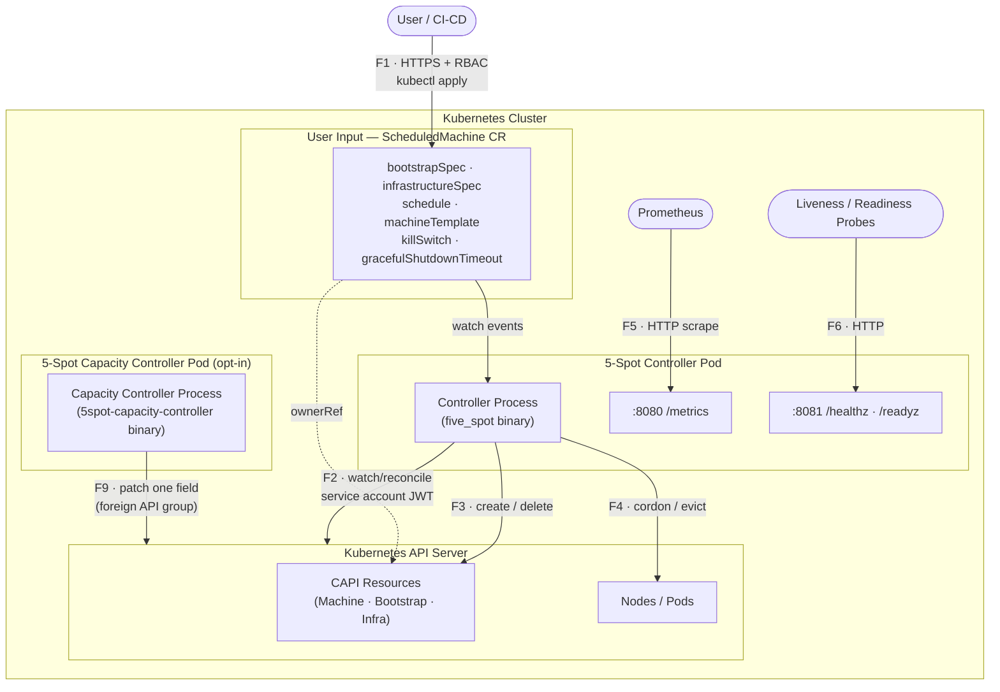
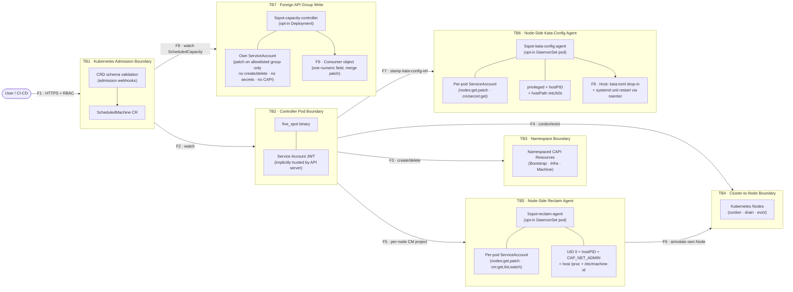

# Threat Model: 5-Spot ScheduledMachine Controller

**Version:** 1.3  
**Date:** 2026-10-04  
**Status:** Active — living document  
**Covers:** ADR-0001 … ADR-0013 (the 1.3 pass implements ADR-0011, which was
Accepted but unimplemented at 1.2: a second controller identity and the first
boundary where 5-Spot writes an API group it does not own. Every section was
walked. Changed: §1 scope (a second binary, a second CRD, and the consumer
declared out of scope), §2 overview and flows F8/F9, §3 three assets, §4 TB7
and its diagram, §5 two actors, §6.6 with nine threats, §7 seven controls, §8
two residuals, §9 two assumptions. §10 unchanged.)  
**Classification:** Public. This page ships in the published documentation site
(`docs/mkdocs.yml` → Security → Threat Model) of a public repository. It states
the *posture* — what is defended, from whom, with which control in which file.
Specific unremediated findings do not belong here; report those privately per
[`SECURITY.md`](https://github.com/finos/5-spot/blob/main/SECURITY.md).

---

## 1. Document Scope

This threat model covers the **5-Spot controller** — a Kubernetes operator that manages the lifecycle of physical machines in k0smotron-backed CAPI clusters based on configurable time schedules.

It identifies assets, trust boundaries, threat actors, per-component STRIDE threats, current mitigations, and residual risk. It is intended to inform security reviews, deployment hardening decisions, and future development.

**In scope:**
- The controller process (`five_spot` binary) and its Kubernetes RBAC surface
- The `5spot-capacity-controller` process and its **separate** RBAC surface (ADR 0011)
- The `ScheduledMachine` and `ScheduledCapacity` Custom Resource Definitions and their admission paths
- All Kubernetes API interactions (CAPI Machine, Bootstrap, Infrastructure, Nodes, Pods), and the single-field `patch` into an allowlisted foreign API group
- The metrics (`/metrics`) and health (`/healthz`, `/readyz`) HTTP endpoints of both controllers

**Out of scope:**
- The underlying k0smotron / CAPI infrastructure providers
- **The capacity consumer**: the object 5-Spot patches, and everything it does with the capacity it is granted. 5-Spot writes a number and waits; claim binding, guest isolation and drain belong to the consumer (ADR 0011, §9 assumption 7)
- The physical machines being managed
- The Kubernetes API server itself
- Network-level threats (CNI, firewall policy)

---

## 2. System Overview


```mermaid
flowchart TB
    User(["User / CI-CD"])

    subgraph cluster["Kubernetes Cluster"]
        subgraph capctrl["5-Spot Capacity Controller Pod (opt-in)"]
            CC["Capacity Controller Process\n(5spot-capacity-controller binary)"]
        end

        subgraph ctrl["5-Spot Controller Pod"]
            C["Controller Process\n(five_spot binary)"]
            M[":8080 /metrics"]
            H[":8081 /healthz · /readyz"]
        end

        subgraph input["User Input — ScheduledMachine CR"]
            SM["bootstrapSpec · infrastructureSpec\nschedule · machineTemplate\nkillSwitch · gracefulShutdownTimeout"]
        end

        subgraph api["Kubernetes API Server"]
            CAPI["CAPI Resources\n(Machine · Bootstrap · Infra)"]
            NP["Nodes / Pods"]
        end

        Prom(["Prometheus"])
        Probes(["Liveness / Readiness Probes"])
    end

    User -->|"F1 · HTTPS + RBAC\nkubectl apply"| SM
    SM -->|watch events| C
    C -->|"F2 · watch/reconcile\nservice account JWT"| api
    C -->|"F3 · create / delete"| CAPI
    C -->|"F4 · cordon / evict"| NP
    SM -.->|ownerRef| CAPI
    CC -->|"F9 · patch one field\n(foreign API group)"| api
    Prom -->|"F5 · HTTP scrape"| M
    Probes -->|"F6 · HTTP"| H
```

### Key Data Flows

| Flow | Description | Protocol | Auth |
|---|---|---|---|
| F1 | User → API Server: create/update ScheduledMachine | HTTPS | Kubernetes RBAC |
| F2 | Controller → API Server: watch ScheduledMachine events | HTTPS/Watch | Service account JWT |
| F3 | Controller → API Server: create/delete CAPI resources | HTTPS | Service account JWT |
| F4 | Controller → API Server: cordon Node, evict Pods | HTTPS | Service account JWT |
| F5 | Prometheus → Controller: scrape metrics | HTTP (no TLS) | None (cluster-internal) |
| F6 | Kubernetes probes → Controller: health checks | HTTP (no TLS) | None (cluster-internal) |
| F7 | Controller → Node: stamp the `kata-config-ref` annotation naming the workload-cluster source object | HTTPS | Service account JWT |
| F8 | Capacity Controller → API Server: watch `ScheduledCapacity`, its spot-schedule provider and its target object | HTTPS/Watch | Capacity service account JWT (separate identity) |
| F9 | Capacity Controller → API Server: `patch` one numeric field on an object in an allowlisted foreign API group. **Never create or delete** | HTTPS | Capacity service account JWT (separate identity) |
| F8 | Kata-config agent → workload API: `get` the named ConfigMap/Secret, then write `/etc/k0s/containerd.d/kata.toml` on the host and restart a systemd unit through `nsenter` | HTTPS, then host namespaces | Per-pod service account JWT, then host PID 1 |
| F9 | Reclaim agent → Node: write the three reclaim annotations | HTTPS | Per-pod service account JWT |

---

## 3. Assets

| Asset | Sensitivity | Description |
|---|---|---|
| **Physical machine availability** | Critical | Machines being added/removed from cluster; unintended removal causes workload disruption |
| **CAPI cluster integrity** | Critical | Bootstrap and infrastructure resources that define cluster membership |
| **Node workloads** | High | Running pods that could be evicted during a drain operation |
| **Controller service account credentials** | High | JWT token granting cluster-wide RBAC privileges |
| **ScheduledMachine spec data** | Medium | Contains infrastructure topology (addresses, ports, SSH config) |
| **Kubernetes RBAC posture** | High | Overly broad permissions on the service account expand blast radius of compromise |
| **Cluster-wide node state** | High | Cordon/drain operations affect all workloads on targeted nodes |
| **`ScheduledCapacity` spec data** | Medium | Names a foreign object and a field path on it. The path is user-controlled input that the capacity controller writes with its own credential, which makes it a confused-deputy surface rather than inert configuration (§6.6 C1) |
| **Conceded host capacity** | High | The slice of a host handed to a consumer while it stays in the cluster. Over-provisioning starves the incumbent workload the host exists to run; under-provisioning or a missed handback silently wastes it |
| **Capacity controller service account credentials** | Medium | JWT granting `patch` on one allowlisted API group and its own CRD's status. Deliberately **lower** sensitivity than the machine controller's: no Secret access, no CAPI verbs, no create or delete anywhere (§6.6 C6) |

---

## 4. Trust Boundaries


```mermaid
flowchart LR
    User(["User / CI-CD"])

    subgraph TB1["TB1 · Kubernetes Admission Boundary"]
        direction TB
        AW["CRD schema validation\n(admission webhooks)"]
        SM["ScheduledMachine CR"]
        AW --> SM
    end

    subgraph TB2["TB2 · Controller Pod Boundary"]
        direction TB
        Bin["five_spot binary"]
        SA["Service Account JWT\n(implicitly trusted by API server)"]
        Bin --- SA
    end

    subgraph TB3["TB3 · Namespace Boundary"]
        direction TB
        NS["Namespaced CAPI Resources\n(Bootstrap · Infra · Machine)"]
    end

    subgraph TB4["TB4 · Cluster-to-Node Boundary"]
        direction TB
        Nodes["Kubernetes Nodes\n(cordon · drain · evict)"]
    end

    subgraph TB5["TB5 · Node-Side Reclaim Agent"]
        direction TB
        Agent["5spot-reclaim-agent\n(opt-in DaemonSet pod)"]
        AgentSA["Per-pod ServiceAccount\n(nodes:get,patch · cm:get,list,watch)"]
        Caps["UID 0 + hostPID + CAP_NET_ADMIN\n+ host /proc + /etc/machine-id"]
        Agent --- AgentSA
        Agent --- Caps
    end

    subgraph TB6["TB6 · Node-Side Kata-Config Agent"]
        direction TB
        KAgent["5spot-kata-config-agent\n(opt-in DaemonSet pod)"]
        KSA["Per-pod ServiceAccount\n(nodes:get,patch · cm/secret:get)"]
        KCaps["privileged + hostPID\n+ hostPath /etc/k0s"]
        KHost["F8 · Host: kata.toml drop-in\n+ systemd unit restart via nsenter"]
        KAgent --- KSA
        KAgent --- KCaps
        KAgent --> KHost
    end

    subgraph TB7["TB7 · Foreign API Group Write"]
        direction TB
        CapCtl["5spot-capacity-controller\n(opt-in Deployment)"]
        CapSA["Own ServiceAccount\n(patch on allowlisted group only\nno create/delete · no secrets · no CAPI)"]
        Target["F9 · Consumer object\n(one numeric field, merge patch)"]
        CapCtl --- CapSA
        CapCtl --> Target
    end

    User -->|"F1 · HTTPS + RBAC"| TB1
    TB1 -->|"F2 · watch"| TB2
    TB2 -->|"F3 · create/delete"| TB3
    TB2 -->|"F4 · cordon/evict"| TB4
    TB2 -->|"F5 · per-node CM project"| TB5
    TB5 -->|"F6 · annotate own Node"| TB4
    TB2 -->|"F7 · stamp kata-config-ref"| TB6
    TB1 -->|"F8 · watch ScheduledCapacity"| TB7
```

**TB7 is the only place 5-Spot writes an API group it does not own** (ADR 0011).
The capacity controller patches one numeric field on a consumer's object so a
spot schedule can gate a bounded slice of a host that **stays in the cluster**,
which is the opposite of every other flow here: TB3 creates and deletes CAPI
resources, TB7 only ever scales a field on an object someone else owns.

Three properties define the boundary, and each is a deliberate narrowing rather
than an accident of implementation:

- **A separate identity.** Its own binary, Deployment and ServiceAccount, so the
  grant cannot compound the machine controller's. Compromising the capacity
  controller cannot delete a CAPI `Machine`; compromising the machine
  controller cannot write capacity. This is the whole reason ADR 0011 chose a
  new binary over a second reconciler in the existing one, and it is why the
  two HIGH residuals in §8 do not grow.
- **`patch` is the only write verb**, on an allowlisted API group, with no
  `create`, no `delete`, no Secret access and no CAPI verbs
  (`deploy/capacity-controller/clusterrole.yaml`). A compromised capacity
  controller cannot bring a consumer's object into existence or destroy it,
  which is what makes the design safe against a pool holding live claims.
- **The field path is user input and is treated as such.** `spec.capacity.path`
  names a field on a foreign object and comes from whoever can create a
  `ScheduledCapacity`, so it is constrained at admission and again in the
  reconciler. See §6.6.

A cluster with no capacity consumer installs none of TB7.

**TB6 is the highest-privilege boundary in the system.** The kata-config agent
is the only component that runs `privileged: true`, and its work — writing a
containerd drop-in to the host filesystem and restarting a host systemd unit
through `nsenter -t 1` — is node-root by construction (ADR 0002, ADR 0003). It
crosses from the Kubernetes API into the host's mount, UTS, IPC, network and PID
namespaces. Everything in §6.5 follows from that.

---

## 5. Threat Actors

| Actor | Capability | Motivation |
|---|---|---|
| **Malicious tenant** | Can create/edit ScheduledMachines in their namespace | Escape namespace, disrupt other tenants, exfiltrate data |
| **Compromised CI/CD** | Can push images or apply manifests | Backdoor controller binary, escalate privileges |
| **Compromised controller pod** | Has the controller's service account | Lateral movement to CAPI resources, node disruption |
| **Rogue operator** | Internal user with broad kubectl access | Misuse kill switch, drain nodes during business hours |
| **Supply chain attacker** | Can inject into upstream crates (kube-rs, serde, etc.) | RCE inside controller, credential theft |
| **Spot-schedule provider (untrusted CRD)** | Owns `status.active` of a `spotschedules.5spot.finos.org` object referenced by a ScheduledMachine | Flap the referenced machines on/off — effectively the same control surface as `spec.enabled` |
| **Compromised capacity controller pod** | Has the capacity controller's service account: `patch` on the allowlisted target group and on its own CRD's status, read-only elsewhere | Starve or over-provision a consumer's capacity. Cannot delete a CAPI `Machine`, read a Secret, or create/delete the governed object: the separation from the machine controller is the control |
| **`ScheduledCapacity` author** | Can create a `ScheduledCapacity` in their namespace, naming a target object and a field path on it | Reach a field the author should not be able to write (`metadata.ownerReferences`, `finalizers`, labels) on an object in an API group 5-Spot holds `patch` on, i.e. use the controller as a confused deputy |

---

## 6. STRIDE Threat Analysis

### 6.1 ScheduledMachine Custom Resource (Trust Boundary: TB1)

#### Spoofing
| ID | Threat | Likelihood | Impact | Status |
|---|---|---|---|---|
| S1 | User crafts a ScheduledMachine that mimics another tenant's resource name to confuse monitoring/alerting | Low | Low | Accepted — names are unique within namespace |
| S2 | Attacker spoofs `ownerReference` UID to claim ownership of existing resources | Low | Medium | Mitigated — UID is set server-side by the controller, not from user input |

#### Tampering
| ID | Threat | Likelihood | Impact | Status |
|---|---|---|---|---|
| T1 | **Cross-namespace resource creation** — user sets `bootstrapSpec.metadata.namespace` to `kube-system` | High | Critical | **Mitigated (2026-04-08, hardened 2026-05-30)** — controller always uses the SM's own namespace; `metadata.namespace`/`metadata.name` are now **loudly rejected** at admission (VAP rules 13c–13f) and at reconcile (`validate_embedded_metadata()`). Only `metadata.labels`/`metadata.annotations` are accepted, reserved-prefix-checked |
| T2 | **Label injection** — user sets `machineTemplate.labels["cluster.x-k8s.io/cluster-name"]` to redirect machine to attacker-controlled cluster | High | Critical | **Mitigated (2026-04-08)** — `validate_labels()` blocks reserved prefixes |
| T3 | **Annotation injection** — user injects `kubectl.kubernetes.io/restartedAt` to trigger rolling restarts | Medium | Medium | **Mitigated (2026-04-08)** — same prefix allowlist |
| T4 | **apiVersion/kind injection** — user sets `bootstrapSpec.kind: ClusterRole` to create RBAC resources | High | High | **Mitigated (2026-04-08)** — `validate_api_group()` enforces allowlist |
| T5 | User injects malicious content into `bootstrapSpec.spec` or `infrastructureSpec.spec` targeting provider vulnerabilities | Medium | High | **Partially mitigated** — spec content is passed opaquely to providers; provider-side validation is out of scope |
| T6 | **Timezone log injection** — user injects newlines/control chars into timezone field to poison structured logs | Low | Low | **Mitigated (2026-04-08)** — CRD schema enforces `pattern: ^[A-Za-z][A-Za-z0-9_+\-/]*$` and `maxLength: 64` |
| T7 | **Duration overflow** — user sets `gracefulShutdownTimeout: "9999999999999h"` causing integer overflow | Medium | High | **Mitigated (2026-04-08)** — `checked_mul` + `MAX_DURATION_SECS = 86400` cap |
| T8 | User updates ScheduledMachine spec after machine is active, changing `clusterName` mid-lifecycle | Medium | Medium | **Residual risk** — spec changes trigger reconciliation; no immutability enforcement on `clusterName` |
| T8a | **Provider-driven activation control** — a compromised or buggy spot-schedule provider flips `status.active`, starting/stopping the machines that reference it | Medium | Medium | **Mitigated (2026-06-14)** — blast radius equals editing `spec.enabled` and is bounded to **same-namespace** SMs that explicitly named the provider (cross-namespace refs are forbidden by design); controller RBAC is **read-only** (`get/list/watch`) on `spotschedules.5spot.finos.org` — it can never write a provider object; the provider group is CEL-pinned at the CRD field, in the VAP (rule 4), and at reconcile (`validate_activation_source()`). Auditable via `status.spotSchedule` (resolved/reason/message) + `fivespot_spot_schedule_*` metrics (ADR 0006) |

#### Repudiation
| ID | Threat | Likelihood | Impact | Status |
|---|---|---|---|---|
| R1 | No audit trail when kill switch is activated | Medium | High | **Residual risk** — Kubernetes audit log captures the CR edit, but controller logs only emit a single line; no structured event emitted |
| R2 | No record of which schedule window caused machine removal | Low | Low | Accepted — status conditions record transition timestamps |

#### Information Disclosure
| ID | Threat | Likelihood | Impact | Status |
|---|---|---|---|---|
| I1 | Error messages in `ReconcilerError` echo user-provided values (timezone, duration, API groups) verbatim | Low | Low | **Residual risk** — these are operator-visible logs, not exposed to end users; impact limited |
| I2 | `bootstrapSpec.spec` may contain infrastructure addresses, credentials, or SSH keys in plaintext | High | High | **Residual risk** — see Section 8 |
| I3 | ScheduledMachine status exposes `nodeRef`, `machineRef` — leaks infrastructure topology to namespace readers | Low | Low | Accepted — intentional observability; readers in the same namespace are trusted |

#### Denial of Service
| ID | Threat | Likelihood | Impact | Status |
|---|---|---|---|---|
| D1 | Attacker creates thousands of ScheduledMachines to overwhelm the controller reconciliation queue | Medium | Medium | **Partially mitigated** — Kubernetes resource quotas and admission webhooks can cap CR count; controller has CPU/memory limits |
| D2 | **Finalizer hang** — drain operation never completes, blocking namespace deletion indefinitely | Medium | High | **Mitigated (2026-04-08)** — `tokio::time::timeout(600s)` wraps finalizer cleanup |
| D3 | Attacker crafts an oversized `ScheduledMachine` CR to slow admission validation | Low | Low | **Mitigated** — `daysOfWeek`/`hoursOfDay` arrays now live on the `TimeBasedSpotSchedule` CRD (validated by its own schema, ADR 0009), not on the `ScheduledMachine` VAP; Kubernetes limits CR size in either case |
| D4 | User triggers kill switch repeatedly causing rapid machine add/remove cycles (thrashing) | Low | Medium | Accepted — kill switch is write-once-by-design; no automatic reactivation |
| D5 | **Provider flapping** — a spot-schedule provider toggles `status.active` rapidly, churning expensive machine create/delete cycles | Low | Medium | **Partially mitigated (2026-06-14)** — transitions are bounded by the controller's reconcile back-off and the machine lifecycle's own grace/drain timers; `fivespot_spot_schedule_transitions_total` exposes the flap rate for alerting (see [monitoring](../operations/monitoring.md)). A per-SM `minimumStateDuration` debounce is recorded as future work in ADR 0006 |

#### Elevation of Privilege
| ID | Threat | Likelihood | Impact | Status |
|---|---|---|---|---|
| E1 | Attacker uses `apiVersion: rbac.authorization.k8s.io/v1, kind: ClusterRole` to create RBAC resources via controller | High | Critical | **Mitigated (2026-04-08)** — API group allowlist |
| E1a | **Escalation through the controller** — user who can create a `ScheduledMachine` but **not** the embedded bootstrap/infrastructure resource has the broadly-permissioned controller create it on their behalf | High | High | **Mitigated (2026-05-29)** — VAP `authorizer` rules (13a/13b) require the *requesting user* to hold `create` on the embedded GVKs; controller's own SA independently gated at reconcile by `ensure_can_create()` (`SelfSubjectAccessReview`) |
| E2 | **Compromised controller pod** gains cluster-wide node cordon/drain, CAPI write access | Medium | Critical | **Partially mitigated** — k0smotron.io RBAC narrowed; bootstrap/infra still use wildcards (provider-agnostic requirement) |
| E3 | Controller service account token stolen from pod filesystem | Low | Critical | **Mitigated** — read-only root filesystem; token mounted at standard path (Kubernetes default); no projected service account with long lifetime |

---

### 6.2 Controller Process (Trust Boundary: TB2)

#### Spoofing
| ID | Threat | Likelihood | Impact | Status |
|---|---|---|---|---|
| S3 | Attacker replaces controller image with backdoored binary | Low | Critical | **Residual risk** — mitigated by image signing (release workflow uses Cosign); `IfNotPresent` pull policy means in-cluster image is trusted |

#### Tampering
| ID | Threat | Likelihood | Impact | Status |
|---|---|---|---|---|
| T9 | Memory corruption in unsafe Rust code or via malformed serde input | Very Low | Critical | **Mitigated** — codebase is safe Rust; no `unsafe` blocks; serde handles malformed input with errors |
| T10 | Supply chain attack via malicious crate version | Low | Critical | **Residual risk** — mitigated by Grype container scan (VEX-aware) in CI; no automated dependency pinning beyond Cargo.lock |

#### Information Disclosure
| ID | Threat | Likelihood | Impact | Status |
|---|---|---|---|---|
| I4 | `/metrics` endpoint accessible without authentication | Medium | Low | Accepted — metrics contain no secrets; exposes operational data only; restricted to cluster network |
| I5 | Service account token exposed via `RUST_LOG=trace` debug output | Low | Medium | **Residual risk** — `RUST_LOG=debug` set in deployment; kube-rs does not log JWT tokens; verify before production |

#### Denial of Service
| ID | Threat | Likelihood | Impact | Status |
|---|---|---|---|---|
| D5 | Pod eviction during drain exhausts Kubernetes API rate limits (`429` responses from PDB) | Medium | Medium | **Mitigated** — `evict_pod` handles 429 gracefully and logs a warning rather than crashing |

---

### 6.3 Node Drain Path (Trust Boundary: TB4)

#### Tampering
| ID | Threat | Likelihood | Impact | Status |
|---|---|---|---|---|
| T11 | Attacker creates ScheduledMachine whose `clusterName` matches a production cluster, triggering drain of production nodes outside schedule | Medium | Critical | **Partially mitigated** — `clusterName` is used only as a label on the created CAPI Machine; actual drain targets the node resolved via the Machine's `nodeRef` |

#### Denial of Service
| ID | Threat | Likelihood | Impact | Status |
|---|---|---|---|---|
| D6 | Grace period expires mid-drain; pods are forcefully killed without completing shutdown hooks | Medium | Medium | Accepted — `POD_EVICTION_GRACE_PERIOD_SECS = 30` is configurable via constant; PDB protection applies |
| D7 | `Api::all()` for Nodes/Pods fetches cluster-wide list; maliciously large cluster could cause memory spike | Low | Low | Accepted — field selector `spec.nodeName=<node>` scopes pod list to one node |

---

### 6.4 Reclaim Agent (Trust Boundary: TB5)

The node-side `5spot-reclaim-agent` DaemonSet runs on opted-in
worker nodes only and signals the controller via three Node
annotations. It is the lowest-trust component in the system: pod
runs as UID 0 with `hostPID: true`, host `/proc` mount, host
`/etc/machine-id` mount, and `CAP_NET_ADMIN` (for rung 2 netlink
proc connector). Per-pod `ServiceAccount` grants only
`nodes: get,patch` cluster-wide and `configmaps: get,list,watch`
in `5spot-system`.

#### Spoofing
| ID | Threat | Likelihood | Impact | Status |
|---|---|---|---|---|
| S5 | Attacker with `update daemonsets` overrides the agent pod's `NODE_NAME` env var, causing the agent to PATCH reclaim annotations on a victim Node it isn't actually running on | Low (precondition is cluster-admin-equivalent in most clusters) | High (would trigger emergency-remove on innocent host) | **Mitigated** — host-identity verification (`read_host_machine_id` + `compare_machine_ids`, security-audit Phase 4, 2026-04-26): agent reads `/etc/machine-id` from a `hostPath.type: File` mount at startup and refuses to PATCH a Node whose `status.nodeInfo.machineID` doesn't match. `--skip-host-id-check` opt-out exists but defaults off. |
| S6 | Compromised pod somewhere else in the cluster spoofs the reclaim annotations directly on a Node, triggering an emergency-remove the agent never decided on | Low | High | **Partially mitigated** — `nodes: patch` is broadly held in most clusters (kubelet itself has it); the controller treats the annotation as authoritative. Mitigation: monitor `5spot.finos.org/reclaim-requested` PATCH events via API audit logs, alert when the field manager is anything other than `5spot-reclaim-agent`. |

#### Tampering
| ID | Threat | Likelihood | Impact | Status |
|---|---|---|---|---|
| T12 | Compromised agent escalates to other Nodes via stolen ServiceAccount token | Low (per-pod SA, scoped credentials) | Medium | **Mitigated** — RBAC: `nodes: get,patch` cluster-wide (no `list/watch` — can't enumerate). Host-identity check refuses any PATCH against a Node whose `machineID` doesn't match the agent's own `/etc/machine-id`. |
| T13 | `CAP_NET_ADMIN` (granted for rung 2 netlink) is misused to send rogue netlink messages on other subsystems | Low | Low–Medium | **Accepted** — `CAP_NET_ADMIN` is Linux's coarsest-grained networking cap and grants more than just netlink connector access (route table edits, iptables, etc.). Scope-bounded in two ways: (1) the cap is added only on opted-in Nodes via the existing `5spot.finos.org/reclaim-agent: enabled` nodeSelector, so only the small set of Nodes with `killIfCommands` set ever sees it; (2) the agent binary is single-purpose with no shell, no exec of children — a compromise would need an attacker to swap the binary, at which point they could grant themselves any cap they wanted. Operators who refuse the cap can pin `--detector=poll` (rung 1) which needs no extra capability. |

#### Repudiation
| ID | Threat | Likelihood | Impact | Status |
|---|---|---|---|---|
| R1 | Agent PATCH on the Node is indistinguishable from controller writes in audit logs | Low | Low | **Mitigated** — the agent uses field manager `5spot-reclaim-agent`; the controller uses the distinct field manager `5spot-controller-reclaim-agent`. Every Node PATCH carries the field manager in `managedFields`, so audit attribution is unambiguous (NIST AU-2 / AU-10). |

#### Information Disclosure
| ID | Threat | Likelihood | Impact | Status |
|---|---|---|---|---|
| I3 | Reading host `/proc/<pid>/cmdline` for matching exposes argv strings (which can include passwords / tokens passed on the command line) to the agent's logs | Low (logs are operator-owned) | Low | **Accepted** — the agent logs `matched_pattern` (the operator-supplied pattern) and the matched pid, NOT the full cmdline. Patterns themselves are operator-authored config, not user input. |

#### Denial of Service
| ID | Threat | Likelihood | Impact | Status |
|---|---|---|---|---|
| D8 | User repeatedly re-enables a SM whose conflicting process is still running, generating an ejection loop | Medium | Low | **Mitigated** — loop-protection: ≥3 reclaims for the same SM within 10 minutes emits a `RapidReReclaim` Warning Event and bumps `fivespot_rapid_re_reclaims_total{namespace, name}`. Operator runbook in [troubleshooting](../operations/troubleshooting.md) covers the response. |
| D9 | Heavy-exec workload (`make -j32`) overwhelms the netlink subscriber's recv loop with `PROC_EVENT_EXEC` traffic | Low | Low | **Accepted** — agent CPU is bounded by container limits (`50m`); `ENOBUFS` on the netlink socket surfaces as `NetlinkError::Io` and is logged, not silently dropped. Operators who anticipate exec storms should pin `--detector=poll`. |

#### Elevation of Privilege
| ID | Threat | Likelihood | Impact | Status |
|---|---|---|---|---|
| E4 | `hostPID: true` lets the agent see all host PIDs — could be abused to extract data from another container's `/proc/<pid>/environ` if the agent is compromised | Low | Medium | **Accepted** — `hostPID` is architecturally required (the agent's job is to read host process state). Mitigated by: opt-in `nodeSelector` (only on nodes with `killIfCommands`), single-purpose binary with no shell, `readOnlyRootFilesystem: true`, drop ALL caps + add only `NET_ADMIN`, `seccompProfile: RuntimeDefault`. Trivy / Semgrep suppressions in `.trivyignore` document the architectural-necessity reasoning. |
| E5 | **Abuse of the namespace-wide pod-security exemption** — the privileged agents require `5spot-system` to be exempted from the cluster's PSA/Gatekeeper/Kyverno baseline; any principal with `create pods` in the namespace (compromised CI, typo'd Deployment) could then run privileged / mount the host root with no admission check | Medium | Critical | **Mitigated (2026-06-10, ADR 0004)** — `5spot-agent-pod-security` deny-by-default `ValidatingAdmissionPolicy` re-imposes the baseline inside `5spot-system`: risky attributes pinned to the two agent ServiceAccounts at their exact documented posture (hostPath clamped per agent, caps clamped to `NET_ADMIN`, `privileged` to the kata agent only), compensating controls mandatory, `hostNetwork`/`hostIPC` and risky ephemeral containers denied outright, `failurePolicy: Fail`. Residual: a principal who can both create pods *and* use an agent SA wears the exception — clamped to the agents' documented posture; SA RBAC is the control. |

### 6.5 Kata-Config Agent (Trust Boundary: TB6)

The node-side `5spot-kata-config-agent` DaemonSet delivers a Kata containerd
drop-in to opted-in workload-cluster nodes (ADR 0002) and restarts the host k0s
service so containerd reloads it (ADR 0003). It is the **only** component that
runs `privileged: true`. Its input is the `5spot.finos.org/kata-config-ref`
annotation the controller stamps on the Node (F7): a compact JSON object naming
the workload-cluster namespace, kind, object name, `data` key, and the systemd
unit to restart. The agent `get`s that one object, writes
`/etc/k0s/containerd.d/kata.toml`, and runs
`nsenter -t 1 -m -u -i -n -p -- systemctl restart <unit>`.

Its per-pod `ServiceAccount` grants `nodes: get,patch` cluster-wide and
`configmaps,secrets: get` (no `list`, no `watch`) in the target namespace.

| ID | Threat | STRIDE | Likelihood | Impact | Status |
|---|---|---|---|---|---|
| K1 | Drop-in written outside `/etc/k0s/` — a host path supplied through the CR or annotation, or a symlink planted on the host, redirects the write anywhere on the node | T, E | Low | **Critical** | **Mitigated** — no CRD field or annotation carries a host path at all (ADR 0005 removed `destPath`); the destination is the fixed `KATA_CONFIG_DEST_PATH` constant, and `confine_dest_path` canonicalizes and re-checks it against the `/etc/k0s/` base before every write and unlink, fail closed (`src/kata_config_agent.rs`) |
| K2 | Command injection through the restart path | T, E | Low | **Critical** | **Mitigated, twice over** — `nsenter_restart_argv` builds an argv vector, so there is no shell anywhere in the path and metacharacters in any field are inert; and since ADR 0012 the argv carries a **second `--`**, between `restart` and the unit, which ends `systemctl`'s own option parsing. The first `--` only ever ended `nsenter`'s (`src/kata_config_agent.rs`) |
| K3 | Drop-in content is attacker-chosen: containerd configuration is executed-adjacent, and the agent restarts the runtime that reads it | T, E | Low | **Critical** | **Accepted — architecturally required.** This is the agent's entire purpose. The control is upstream: whoever may set `spec.kata` on a `ScheduledMachine`, or write the Node annotation, is choosing containerd configuration on that node. **Treat `create`/`update` on `scheduledmachines` carrying `spec.kata`, and `patch nodes` in the workload cluster, as node-root-equivalent grants** (§7 deployment controls, §8) |
| K4 | Restart of an unintended host unit | T, D | Low | High | **Mitigated for the injection case (ADR 0012)** — the argv's option terminator means a value beginning with `-` is a unit name and not a flag such as `-H` (remote host over SSH), `-M` (container) or `--root=`. The CRD pattern is anchored so a leading hyphen is not admissible (`src/crd.rs`), and `parse_kata_ref` re-checks the same rule on the agent's own input. **Not** mitigated for the policy case: a syntactically valid unit the operator did not intend — `sshd.service` matches and always will — which is why §7 treats `spec.kata` as a node-root-equivalent grant |
| K5 | The agent trusts its Node annotation, which RBAC cannot scope to the agent's own Node | S, T, E | Low | High | **Mitigated for the agent case (ADR 0012 + ADR 0013).** ADR 0012 made the agent distrust the annotation's *shape* — `parse_kata_ref` validates every field and refuses a bad one, so no write and no restart. ADR 0013 addresses its *authority*: `deploy/admission/kata-config-annotation-policy.yaml` rejects any Node `UPDATE` that changes `5spot.finos.org/kata-config-ref` when the requester is a node-agent ServiceAccount, comparing `object` against `oldObject` so their own `kata-config-applied` writes still pass. A compromised agent can no longer retarget another node. **Residual:** anything *else* holding cluster-wide `nodes: patch` — a human admin, a CI identity — still can; see §8 |
| K6 | Stolen agent token enumerates or reads the workload cluster | I | Low | Medium | **Mitigated** — `get` only on `configmaps`/`secrets`, no `list`/`watch`: a stolen token reaches objects the attacker can already name, not the namespace (`deploy/kata-config-agent/rbac.yaml`) |
| K7 | The agent's `privileged` posture is inherited by an unrelated pod in `5spot-system` | E | Medium | **Critical** | **Mitigated (ADR 0004)** — `5spot-agent-pod-security` VAP pins `privileged` to the kata agent's ServiceAccount alone, clamps hostPath per agent, denies `hostNetwork`/`hostIPC`, `failurePolicy: Fail` (`deploy/admission/agent-pod-security-policy.yaml`) |
| K8 | Restart loop — every reconcile bounces the host service | D | Low | High | **Mitigated** — the applied-content hash is recorded in the `kata-config-applied` Node annotation and `needs_restart` fires only on an actual content transition (`src/kata_config_agent.rs`) |

### 6.6 Capacity Controller (Trust Boundary: TB7)

The `5spot-capacity-controller` Deployment reconciles `ScheduledCapacity` and
patches **one numeric field** on an object in an API group 5-Spot does not own,
so a spot schedule can gate a bounded slice of a host that stays in the cluster
(ADR 0011). It never creates or deletes that object and never sets an
`ownerReference` on it.

Its own `ServiceAccount` grants `patch` on the allowlisted target group and on
its own CRD's `/status`, read-only on the spot-schedule group and on
`scheduledmachines`, plus `create` on `selfsubjectaccessreviews`. It holds **no**
Secret access, **no** CAPI verbs, and `create`/`delete` nowhere.

The interesting attacker here is not the compromised pod but the
**`ScheduledCapacity` author**, who supplies a field path that the controller
then writes with its own, broader credential: a confused-deputy shape.

| ID | Threat | STRIDE | Likelihood | Impact | Status |
|---|---|---|---|---|---|
| C1 | `spec.capacity.path` names `metadata.ownerReferences`, `finalizers` or labels, so a CR author uses the controller's credential to take ownership of, block deletion of, or re-label an object in the target group | T, E | Medium | **High** | **Mitigated, twice over**: the path must match `CAPACITY_PATH_PATTERN` (dot-separated camelCase, so no indices, wildcards, `..`, quotes or `/`) **and** a CEL rule pins it to the `spec.` prefix, so `metadata.` and `status.` are inadmissible (`src/crd.rs`). The reconciler re-validates before any API call (`src/reconcilers/capacity_path.rs`), which is the check that still holds when the deployed CRD is older than the binary, precisely the case a schema cannot defend. Verified against a live API server: `metadata.ownerReferences`, `metadata.finalizers`, `metadata.labels` and `status.claimed` are all rejected at admission |
| C2 | The path is read as a JSON Pointer or JSONPath expression, so `~0`, `/`, `[0]` or a quoted segment escapes the intended field | T, E | Low | **High** | **Mitigated**: the charset is an **allowlist** (`[a-z][a-zA-Z0-9]*` per segment), not a denylist of dangerous characters, so nothing outside camelCase is expressible regardless of how the value is later interpreted. Actuation builds a nested merge patch from the validated segments rather than parsing a path expression (`capacity_path.rs::build_merge_patch`) |
| C3 | The target is an object in an API group the controller was never meant to write | T, E | Low | High | **Mitigated**: `ALLOWED_CAPACITY_TARGET_API_GROUPS` (`src/constants.rs`) is the third allowlist beside the bootstrap and infrastructure ones, checked in the reconciler so the permitted set lives in one greppable place and cannot be widened by a stale CRD. The ClusterRole grants `patch` on exactly those groups, so RBAC is the second gate |
| C4 | A capacity write destroys in-flight work: a consumer's pool is zeroed while claims are live | T, D | Medium | High | **Mitigated by construction**: actuation is a field write, never a delete, and the inactive value is a *warm-pool* zero: it stops replenishment while claimed work finishes on its own. The consumer owns claim binding and drain, which 5-Spot has no way to reason about. On deactivation the controller writes zero and then **waits** for `spec.handback.drainedPath` to reach zero, up to `handback.timeout`; on expiry it **holds and reports loudly** rather than escalating (ADR 0011 decision 6), because a missed handover is visible and recoverable while killed work is not |
| C5 | A host is governed by both a `ScheduledMachine` and a `ScheduledCapacity`, so it is drained for handover while capacity is still being sized on it | T, D | Medium | Medium | **Mitigated, with a known gap.** `spec.nodeName` is compared against every `ScheduledMachine.status.nodeRef.name` in the namespace and a match sets `HostGovernanceConflict=True` and refuses to write (`src/reconcilers/scheduled_capacity.rs`). This is controller-side, not admission: a `ValidatingAdmissionPolicy` evaluates one request against its own object and its `paramRef` and cannot look up other objects at all. **Gap:** a conflict arising *after* a value was written leaves that value in place, because refusing to write also refuses to write zero. §8 |
| C6 | The capacity grant compounds the machine controller's CAPI and bootstrap/infrastructure wildcards | E | Low | **High** | **Mitigated: this is the reason for the separate binary.** A distinct ServiceAccount, Deployment and ClusterRole; the machine controller's ClusterRole is not extended (ADR 0011 decision 3). Verified against a live API server with 26 `SubjectAccessReview` assertions: the capacity identity cannot delete or create a CAPI `Machine`, read a Secret, create or delete the governed object, patch a `ScheduledMachine`, or evict a Pod |
| C7 | An RBAC gap surfaces as a partial write or an opaque 403 mid-actuation | D | Low | Low | **Mitigated**: a pre-flight `SelfSubjectAccessReview` for `patch` on the resolved target runs before the first write, so a missing grant becomes a `TargetResolved=False` condition naming the resource (ADR 0011 decision 5) |
| C8 | The controller re-patches its own status every reconcile, re-triggering its own watch and flooding the API server | D | Low | Medium | **Mitigated**: condition `lastTransitionTime` is preserved unless the condition's `status` changes, and the computed status is compared against the stored one so a no-op patch is never sent. Found by running against a real API server, which measured ~50 `resourceVersion` bumps/second before the fix; pinned by a test that derives the expected status key set from the type rather than a hand-written list |
| C9 | A missing or unparseable drain counter is read as "drained", completing a handback that never happened | T, D | Low | Medium | **Mitigated**: `Some(0)` and `None` are deliberately different answers: an unread or non-numeric counter keeps the object in `HandingBack` and says so in the status message, rather than being collapsed to zero (`capacity_path.rs::read_i64_at`) |

---

## 7. Mitigations Summary

### Implemented (as of 2026-09-23)

| Control | Where | Addresses |
|---|---|---|
| `EmbeddedResource.namespace` field removed | `src/crd.rs` | T1 — cross-namespace creation |
| `validate_api_group()` allowlist | `src/reconcilers/helpers.rs` | T4, E1 — kind/apiVersion injection |
| `validate_labels()` reserved prefix rejection | `src/reconcilers/helpers.rs` | T2, T3 — label/annotation injection |
| `checked_mul` + `MAX_DURATION_SECS` cap | `src/reconcilers/helpers.rs` | T7 — duration overflow |
| Timezone `maxLength` + character pattern in CRD | `src/crd.rs` | T6 — log injection |
| `tokio::time::timeout(600s)` in finalizer cleanup | `src/reconcilers/helpers.rs` | D2 — finalizer hang |
| k0smotron.io RBAC narrowed to explicit resources | `deploy/deployment/rbac/clusterrole.yaml` | E2 — over-privileged SA |
| Non-root container, read-only root filesystem, all caps dropped | `deploy/deployment/deployment.yaml` | E3 — token theft |
| CPU/memory resource limits | `deploy/deployment/deployment.yaml` | D1 — resource exhaustion |
| PDB 429 handling in `evict_pod` | `src/reconcilers/helpers.rs` | D5 — API rate limit crash |
| Cosign image signing in release CI | `.github/workflows/release.yaml` | S3 — image tampering |
| Host-identity verification (machine-id cross-check) | `src/reclaim_agent.rs::compare_machine_ids` + `deploy/node-agent/daemonset.yaml` (`/etc/machine-id` mount) | S5 — DaemonSet-tampering NODE_NAME spoof |
| Distinct field managers (`5spot-reclaim-agent` vs `5spot-controller-reclaim-agent`) | All Node PATCH paths | R1 — audit attribution |
| Per-pod `ServiceAccount` with `nodes: get,patch` only (no `list/watch`) | `deploy/node-agent/rbac.yaml` | T12 — agent enumerates other Nodes |
| Opt-in `5spot.finos.org/reclaim-agent: enabled` nodeSelector | `deploy/node-agent/daemonset.yaml` | T13 — `CAP_NET_ADMIN` scope-bounding |
| Loop-protection (`RapidReReclaim` warning + counter) | `src/loop_protection.rs` + `src/reconcilers/helpers.rs::handle_emergency_remove` | D8 — re-enable loop |
| Agent pod-security exception boundary (`5spot-agent-pod-security` VAP, deny-by-default in `5spot-system`) | `deploy/admission/agent-pod-security-policy.yaml` + binding (ADR 0004) | E5 — abuse of the namespace-wide PSA/OPA/Kyverno exemption the privileged agents require |
| Capacity write path constrained to `spec.` camelCase segments (CRD pattern + CEL rule, re-checked in the reconciler) | `src/crd.rs`, `src/reconcilers/capacity_path.rs` | C1, C2: confused-deputy write to `metadata.`/`status.`, pointer-escape |
| Capacity target API group allowlist, checked in the reconciler and mirrored in RBAC | `src/constants.rs` (`ALLOWED_CAPACITY_TARGET_API_GROUPS`), `deploy/capacity-controller/clusterrole.yaml` | C3: write to an unintended API group |
| Separate capacity identity: own binary, Deployment, ServiceAccount and ClusterRole; `patch` only, no create/delete/secrets/CAPI | `deploy/capacity-controller/` (ADR 0011) | C6: compounding the machine controller's CAPI and bootstrap wildcards |
| Pre-flight `SelfSubjectAccessReview` for `patch` before the first capacity write | `src/reconcilers/scheduled_capacity.rs` | C7: opaque 403 or partial write on an RBAC gap |
| Cooperative bounded handback: write zero, wait on `drainedPath`, hold and report on timeout; never delete or force | `src/reconcilers/capacity_decision.rs` (ADR 0011 decision 6) | C4: destroying a consumer's in-flight work |
| No-op status patch guard and preserved condition timestamps | `src/reconcilers/scheduled_capacity.rs` | C8: self-triggering reconcile loop against the API server |

### Supply Chain (TB0 — contributor / CI to published artifact)

§5 lists a supply-chain attacker; these are the controls that answer it. All of
them run in `.github/workflows/`.

| Control | Where | Addresses |
|---|---|---|
| SLSA build provenance on every release | `.github/workflows/build.yaml` (`provenance: true`) | Forged or substituted release artifact |
| Cosign keyless signing, by digest not tag | `.github/workflows/build.yaml` | S3 — image tampering after publication |
| SBOM generated per image and per release | `.github/workflows/build.yaml` (`sbom: true`, `anchore/sbom-action`) | Unknown component inventory |
| Auto-VEX presence + reachability gate, byte-exact, fails closed (ADR 0008) | `src/bin/auto_vex_*.rs`, `.vex/`, release workflow | An advisory shipping untriaged |
| Base images digest-pinned on the `FROM` line, Dependabot-tracked (ADR 0010) | `Dockerfile`, `Dockerfile.chainguard`, `.github/dependabot.yml` | A stale or substituted base image |
| Actions SHA-pinned; Dependabot groups and a 7-day cooldown per ecosystem | `.github/workflows/*`, `.github/dependabot.yml` | A compromised action release |
| Scanning: CodeQL, Trivy (image + IaC), grype, `cargo audit`, `cargo deny`, gitleaks, Semgrep | `.github/workflows/` | Known-vulnerable dependency, leaked credential |
| No `pull_request_target`, no `issue_comment`; untrusted event fields reach `run:` only through `env:` | `.github/workflows/` | Workflow script injection from a fork |

### Deployment-Layer Controls (operator responsibility)

| Control | Recommendation |
|---|---|
| Kubernetes ResourceQuota | Limit `ScheduledMachine` count per namespace (e.g., max 50) |
| `ValidatingAdmissionPolicy` ✅ deployed 2026-04-08 | Validates `bootstrapSpec.apiVersion`, `infrastructureSpec.apiVersion`, `kind` fields, duration format, and day/hour item format at admission time — see `deploy/admission/` |
| NetworkPolicy | Restrict controller pod egress to the management API server (6443), child/k0smotron-hosted control planes (NodePort apiPort 30443), and DNS — all other egress denied |
| Audit logging | Enable API server audit log at `RequestResponse` level for `scheduledmachines` resources |
| RBAC for SM creation | Only grant `create` on `scheduledmachines` to trusted identities; do not grant to end users directly |
| RBAC for `spec.kata` | A `ScheduledMachine` carrying `spec.kata` chooses containerd configuration on a node and triggers a host service restart (§6.5). Grant it only to identities you would trust with node root |
| RBAC for `patch nodes` (workload cluster) | Node-root-equivalent wherever the kata-config agent runs — the agent's input is a Node annotation. See §8 |
| Secrets for bootstrap data | Move sensitive bootstrap config out of CR spec into Secrets; reference from spec |

---

## 8. Residual Risks

### HIGH — Sensitive data in `bootstrapSpec.spec`

**Threat:** `EmbeddedResource.spec` is an arbitrary JSON object with `x-kubernetes-preserve-unknown-fields: true`. It may contain SSH keys, IP addresses, tokens, or other credentials stored in plaintext in etcd and visible to anyone with `get scheduledmachines` access.

**Recommendation:** Introduce a `secretRef` field alongside `spec` that references a Secret, and merge the Secret's data at runtime inside the controller. This keeps credentials out of the CR and benefits from Kubernetes secret encryption-at-rest.

**Workaround (now):** Restrict `get/list` on `scheduledmachines` to the owning service account and cluster admins only.

---

### HIGH — Bootstrap/Infrastructure RBAC wildcards

**Threat:** `bootstrap.cluster.x-k8s.io` and `infrastructure.cluster.x-k8s.io` still use `resources: ["*"]` in the ClusterRole because the controller is designed to be provider-agnostic. A compromised controller can create any bootstrap or infrastructure resource cluster-wide.

**Recommendation:** For deployments targeting a single known provider, replace wildcards with explicit resource lists (e.g., `k0sworkerconfigs` only). Document this in the operator deployment guide.

---

### MEDIUM — `clusterName` immutability

**Threat:** A user can update `spec.clusterName` on an active ScheduledMachine. The controller will reconcile with the new cluster name, potentially creating CAPI resources in a different cluster while leaving orphaned resources in the original cluster.

**Recommendation:** Use a CEL validation rule (`x-kubernetes-validations`) to make `clusterName` immutable after creation:
```yaml
x-kubernetes-validations:
  - rule: "self == oldSelf"
    message: "clusterName is immutable"
```

---


### LOW — Kill switch audit trail

**Threat:** Activating `spec.killSwitch: true` immediately removes a machine. The only record is the Kubernetes API audit log (if enabled). No Kubernetes Event is emitted by the controller.

**Recommendation:** Emit a Kubernetes Event with `reason: KillSwitchActivated` and `type: Warning` when the kill switch fires, so it appears in `kubectl describe scheduledmachine` and feeds into alerting pipelines.

---

### MEDIUM: A governance conflict does not retract capacity already written

`ScheduledCapacity` refuses to write when `spec.nodeName` matches a
`ScheduledMachine`'s `status.nodeRef.name` (C5), but "refuse to write" also
refuses to write **zero**. A conflict that arises *after* a value was written
therefore leaves that value in place: the node can be drained for handover by
the machine controller while the consumer still believes it may size guests on
it, which is the half-working state ADR 0011 decision 7 exists to prevent.
Observed in a live test, which ended with `HostGovernanceConflict=True` and the
target still holding the active value.

Driving the field to zero on conflict would close it, at the cost of writing
during a state the ADR declares unwritable, and would destroy legitimate
capacity when the conflict is a mis-set `spec.nodeName` rather than a real
overlap.

**Revisit when:** the first real deployment governs a host with both kinds, or
a consumer reports capacity surviving a handover. The decision belongs in a
superseding ADR, not a CRD field.

### LOW: Capacity rows written under the old scheme are not reclaimed

Not a 5-Spot control: noted because operators will see it. Where a consumer's
status aggregates per-writer rows, rows written before a writer's identity
changes are not taken over by the new identity and persist until the consumer
prunes them. 5-Spot neither writes nor reads those rows.

**Revisit when:** a consumer asks 5-Spot to participate in pruning.

### MEDIUM — Node-side agents hold cluster-wide `nodes: patch`

**Threat:** Both DaemonSet agents act only on their own Node — the reclaim agent
writes its three reclaim annotations, the kata-config agent records the applied
hash and clears the opt-in label on tear-down — but Kubernetes RBAC cannot
express "the Node this pod runs on". Both ServiceAccounts therefore hold
`nodes: patch` across the cluster. `list`/`watch` are deliberately withheld
(T12, K6), so an agent cannot enumerate the cluster; it can still write to a
Node it can name.

This matters more for the kata-config agent than for the reclaim agent, because
the `5spot.finos.org/kata-config-ref` annotation is not merely data: it is an
*instruction* consumed by a privileged component on the node that reads it
(§6.5, K5). The Node annotation — not the CRD — is that agent's real input, and
the `ScheduledMachine` schema does not gate it.

**Narrowed twice on 2026-09-27.** ADR 0012 made the agent validate every field of
the annotation before acting on it, so a malformed or option-shaped value is
refused rather than executed. ADR 0013 then took the recommendation below and
shipped it: `deploy/admission/kata-config-annotation-policy.yaml` denies the
node agents any change to `5spot.finos.org/kata-config-ref`, which closes the
node-to-node lateral path this entry was written about.

**What is left** is narrower and belongs to the operator: the agents' grant is
still cluster-wide, and *other* holders of `nodes: patch` — a human admin, a CI
identity, other tooling — can still write the key. Per-node ServiceAccounts with
`resourceNames` would close that and were rejected as a lifecycle system in
exchange for a bound admission gives for nothing (ADR 0013).

**The control that shipped**, for reference: a
`ValidatingAdmissionPolicy` on `nodes` UPDATE that permits a change to the
`5spot.finos.org/kata-config-*` annotation keys only when
`request.userInfo.username` is the controller's ServiceAccount, denying it to
every other principal including the agents themselves. This bounds the
annotation to its one legitimate writer without needing per-node ServiceAccounts.

**Workaround (now):** Treat `patch nodes` in a workload cluster running the
kata-config agent as a node-root-equivalent grant, and review every binding that
carries it. Audit changes to `5spot.finos.org/kata-config-ref` — the controller's
field manager is the only expected writer.

---

### LOW — Multi-instance hash distribution weakness

**Threat:** The consistent hash function adds `priority * 1000` to a 64-bit hash, which provides negligible differentiation. High-priority resources may cluster on one instance.

**Recommendation:** Use a proper consistent hash ring (e.g., rendezvous hashing) when HA multi-instance support is hardened.

---

## 9. Security Assumptions

The following conditions are assumed to be true for this threat model to hold:

1. **Kubernetes API server is trusted** — requests to the API server are authenticated and authorized; no API server vulnerabilities are in scope.
2. **etcd encryption at rest is enabled** — CR specs (which may contain infrastructure details) are encrypted in etcd.
3. **RBAC for ScheduledMachine creation is restricted** — only trusted users/service accounts have `create` permission on `scheduledmachines`.
4. **Container image integrity** — the controller image is pulled from a trusted registry; image signing is enforced.
5. **Cluster network is trusted** — the metrics and health endpoints are not accessible from outside the cluster.
6. **Node-level isolation** — physical machines managed by 5-Spot do not share sensitive workloads with other tenants.
7. **The capacity consumer enforces its own drain semantics**: 5-Spot writes a capacity field and waits; it has no way to evict, reclaim or account for work already running inside the slice. A consumer that reports drained while work continues, or that never reports at all, is outside 5-Spot's control (C4, C9). This is the deliberate division of labour in ADR 0011: the consumer owns claim binding and drain, 5-Spot owns only the calendar.
8. **`create` on `scheduledcapacities` is restricted**: the field path in a `ScheduledCapacity` is written by the controller with its own credential, so the grant is a confused-deputy surface. The path is constrained (C1, C2) and the target group is allowlisted (C3), but whoever may create one still chooses which allowlisted object gets scaled and by how much. Treat it with the same care as `create` on `scheduledmachines`.

---

## 10. Related Documents

- [Architecture](../concepts/architecture.md)
- [Machine Lifecycle](../concepts/machine-lifecycle.md)
- [RBAC Configuration](https://github.com/finos/5-spot/blob/main/deploy/deployment/rbac/clusterrole.yaml)
  — a repository file, not a site page
- [API Reference](../reference/api.md)
- [Developer Guide](../development/index.md) — the ADD cycle and the decision log
